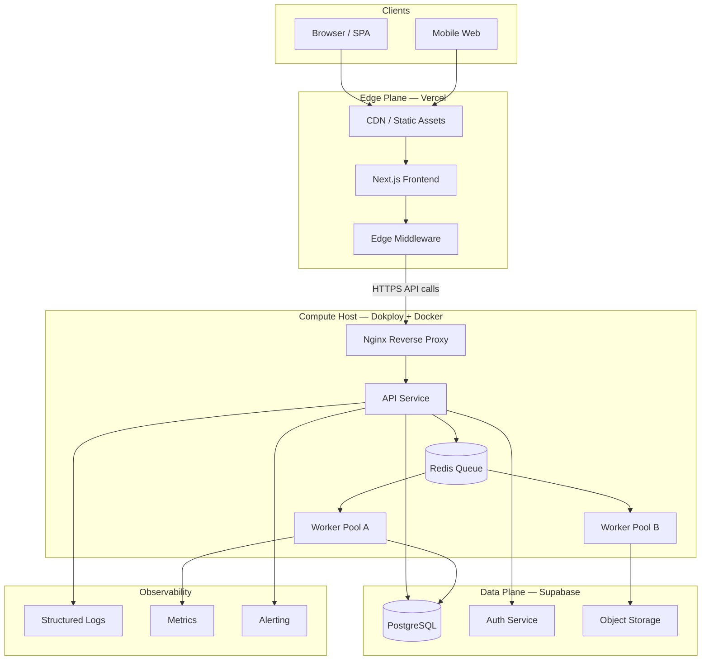
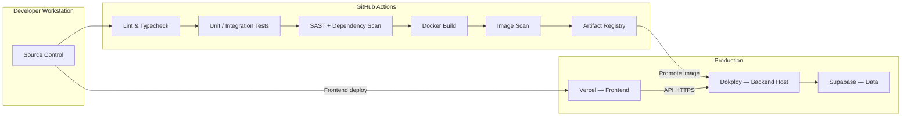
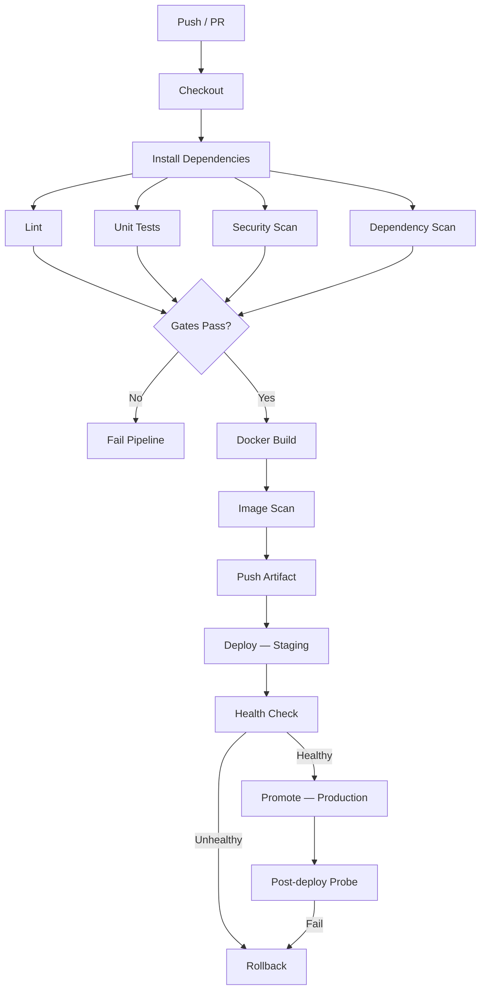
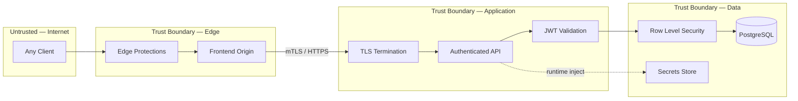
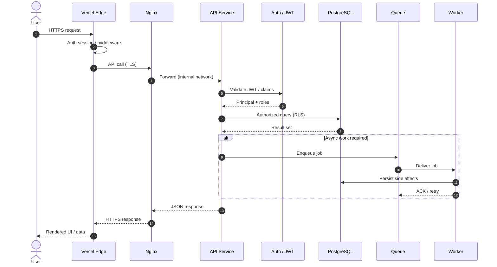

# Licitech — Architecture Showcase

> **Idioma:** [English](README.md) · Português (Brasil)

Documentação de arquitetura, DevOps e segurança por trás do [Licitech](https://www.licitech.com.br/) — um SaaS em produção para busca e gestão de licitações públicas.

---

> [!IMPORTANT]
> **Este repositório não contém o código de produção.**
> O Licitech é um produto comercial. Aqui está a documentação sanitizada da arquitetura — decisões, diagramas C4, ADRs e templates de configuração — sem lógica de negócio, schemas reais, credenciais ou endpoints vivos.

---

## Sobre o produto

O [Licitech](https://www.licitech.com.br/) é uma plataforma para empresas que vendem ao governo. Na prática, ela cobre o ciclo operacional de licitações:

- **Busca** de editais por UF, modalidade e palavras-chave
- **Alertas** (WhatsApp e e-mail) quando algo bate com o perfil do fornecedor
- **Monitor de posição** e chat em pregões (Compras.gov.br)
- **Robô de lances** no ComprasNet e BLL
- **Gestão** do ciclo — orçamento, proposta e acompanhamento

Os dados vêm de fontes públicas de compras (incluindo PNCP / Compras.gov.br). O time usa a plataforma no dia a dia; este repositório documenta como o sistema foi construído por baixo.

Produto em produção: **[licitech.com.br](https://www.licitech.com.br/)**

### Buscador

Filtros por palavras-chave, UF e modalidade — editais agregados de fontes públicas num só lugar.

### Robô de lances

Disputas ao vivo no Compras.gov.br: posição, melhor lance e estratégia automática sem ficar grudado no portal.

---

## Por que este repositório existe

Não dá para abrir o código-fonte de um SaaS comercial. Mesmo assim, faz sentido mostrar como a engenharia foi pensada: fronteiras de serviço, segurança, CI/CD, escalabilidade e trade-offs reais.

O material abaixo descreve essa base — útil para quem avalia o trabalho técnico por trás do produto (incluindo processos acadêmicos).

---

## Destaques de engenharia

### Arquitetura

- Fronteiras claras entre UI na edge, API, workers e o plano de dados
- Aplicação **stateless** — estado durável no PostgreSQL / object storage
- Processamento assíncrono por **fila** (ingestão e jobs longos)
- Isolamento de falha por containers
- Documentado com **C4** e **ADRs** — veja [`docs/pt-br/`](docs/pt-br/)

### Segurança

- Defesa em camadas: edge → reverse proxy → app → RLS → secrets
- Auth com JWT, menor privilégio e Row Level Security
- Scan de dependências e imagens no pipeline; SBOM
- Threat model em **STRIDE** — [`docs/pt-br/THREAT_MODEL.md`](docs/pt-br/THREAT_MODEL.md)

### Infraestrutura

- **Docker** + **Dokploy** no backend
- **Vercel** para o frontend Next.js
- **Supabase / PostgreSQL** no plano de dados
- **Nginx** com TLS no host
- Templates em [`config-templates/`](config-templates/)

### DevOps

- **GitHub Actions**: lint → teste → security scan → build → deploy
- Imagens versionadas por SHA; promoção com health check
- Rollback explícito; secrets separados por ambiente

### Escalabilidade e confiabilidade

- Scale-out de API e workers; connection pooling
- Metas de **RPO / RTO** e runbooks de restore
- Um worker cair não deve derrubar a API
- Caminho documentado para OpenTelemetry e, se precisar, Kubernetes

---

## Diagramas

### Arquitetura geral

### Deploy

### Pipeline de CI/CD

### Fronteiras de segurança

### Ciclo de vida de uma request

---

## Decisões de engenharia

| Decisão | Por quê | Trade-off |
|---|---|---|
| **Docker em vez de Kubernetes** | Chegar em produção mais rápido; ops cabe no time | Menos HPA / mesh nativos — por enquanto |
| **Dokploy** | Deploy, health e rollback sem montar PaaS próprio | Acoplamento à plataforma; saída via imagem Docker |
| **Vercel no frontend** | CDN, preview deploys, pouco ops no Next.js | Jobs longos ficam no backend |
| **PostgreSQL** | Integridade, RLS, ecossistema maduro | Índices e pool precisam de cuidado |
| **Supabase** | Postgres + Auth + Storage com RLS | Vendor — abstraímos via repositories |
| **GitHub Actions** | Perto do código; actions de segurança maduras | Minutos de runner e concorrência |
| **Backend stateless** | Scale horizontal simples | Estado vai para DB / cache |
| **Fila para trabalho pesado** | Request path fica leve | Consistência eventual; idempotência |

Detalhes: [`docs/pt-br/ADR/`](docs/pt-br/ADR/) · [`docs/pt-br/TECHNOLOGY_CHOICES.md`](docs/pt-br/TECHNOLOGY_CHOICES.md)

---

## Navegação

| Caminho | Conteúdo |
|---|---|
| [`docs/pt-br/ARCHITECTURE.md`](docs/pt-br/ARCHITECTURE.md) | Design, fronteiras, fluxos, HA |
| [`docs/pt-br/DEVOPS_AND_CICD.md`](docs/pt-br/DEVOPS_AND_CICD.md) | Pipelines, versionamento, deploy, rollback |
| [`docs/pt-br/SECURITY_AND_COMPLIANCE.md`](docs/pt-br/SECURITY_AND_COMPLIANCE.md) | AuthZ, OWASP, supply chain, LGPD |
| [`docs/pt-br/OBSERVABILITY.md`](docs/pt-br/OBSERVABILITY.md) | Logs, métricas, tracing, incidentes |
| [`docs/pt-br/SCALABILITY.md`](docs/pt-br/SCALABILITY.md) | Scale horizontal, pools, cache, caminho K8s |
| [`docs/pt-br/PERFORMANCE.md`](docs/pt-br/PERFORMANCE.md) | Edge, CDN, DB, async |
| [`docs/pt-br/DISASTER_RECOVERY.md`](docs/pt-br/DISASTER_RECOVERY.md) | Backups, RPO/RTO |
| [`docs/pt-br/THREAT_MODEL.md`](docs/pt-br/THREAT_MODEL.md) | STRIDE |
| [`docs/pt-br/TECHNOLOGY_CHOICES.md`](docs/pt-br/TECHNOLOGY_CHOICES.md) | Por que cada tecnologia |
| [`docs/pt-br/ADR/`](docs/pt-br/ADR/) | Architecture Decision Records |
| [`docs/pt-br/C4/`](docs/pt-br/C4/) | Context, Container, Component |
| [`config-templates/`](config-templates/) | Compose, Nginx, Prometheus, env |
| [`ROADMAP-pt-br.md`](ROADMAP-pt-br.md) | Próximos passos |

---

## Roadmap

Curto prazo: OpenTelemetry, canary releases, Secrets Manager e Terraform. Depois: Kubernetes, blue/green e DR multi-região — se as métricas pedirem. Ver [`ROADMAP-pt-br.md`](ROADMAP-pt-br.md).

---

## Autor

**Alisson Oliveira** — Engenheiro de Software / Cientista de Dados

- GitHub: [@alissonf216](https://github.com/alissonf216)
- LinkedIn: [linkedin.com/in/alissonfranclin](https://www.linkedin.com/in/alissonfranclin/)
- Produto: [licitech.com.br](https://www.licitech.com.br/)

---

## Licença

[MIT License](LICENSE). Documentação e templates para fins educacionais e de portfólio.
