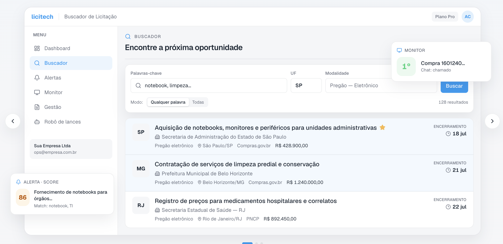
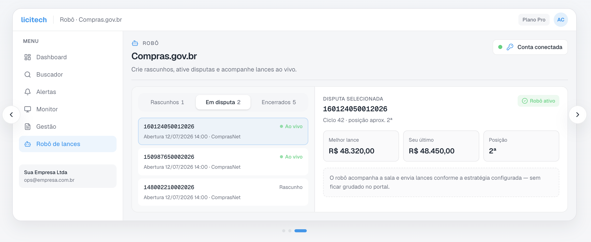
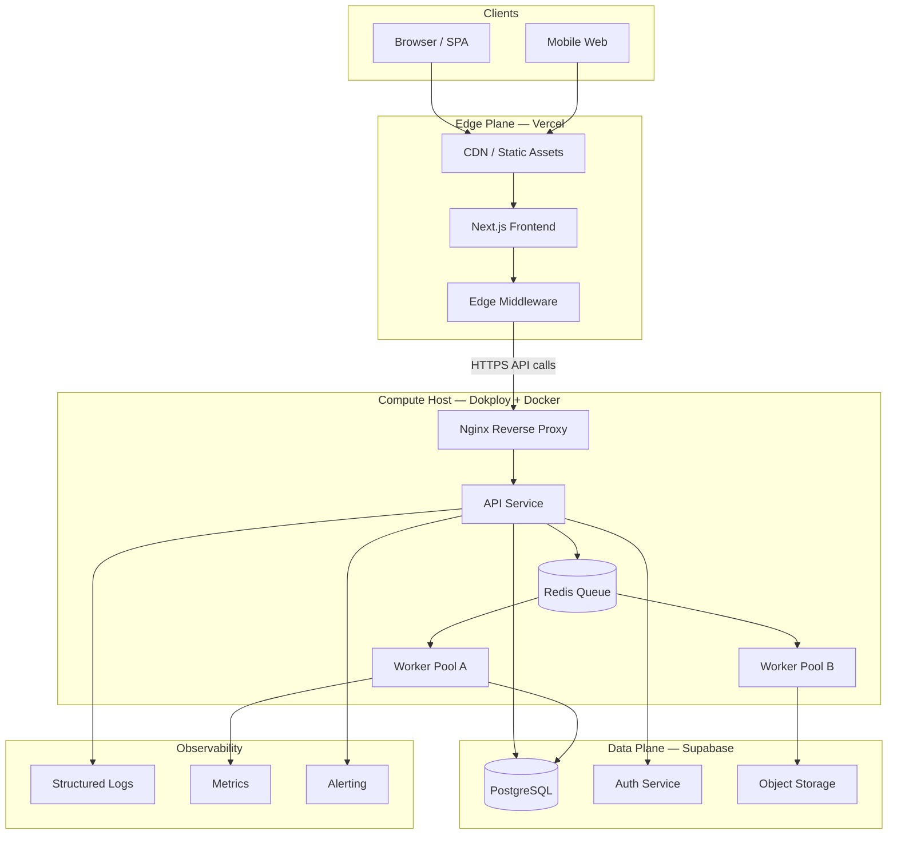
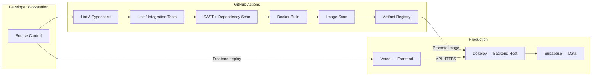
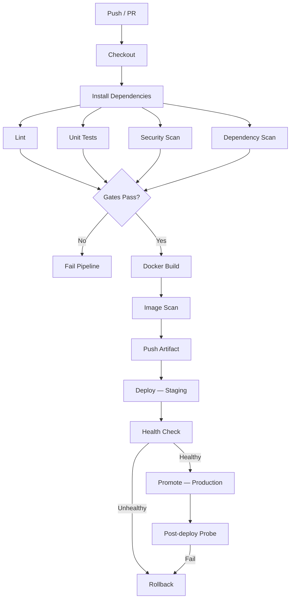
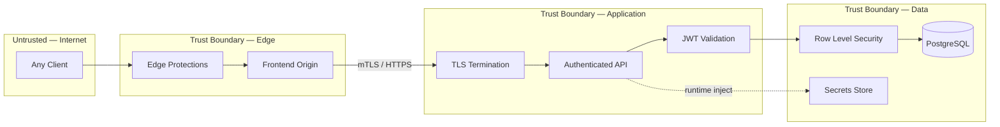
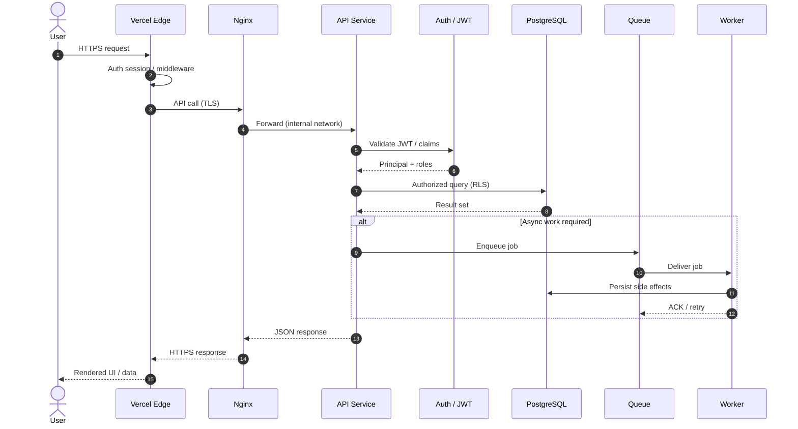

# Licitech — Architecture Showcase

> **Language:** English · [Português (Brasil)](README-pt-br.md)
>
> The English version of this repository was translated with the assistance of **Gemini 3.6 Flash**.

Architecture, DevOps, and security documentation behind [Licitech](https://www.licitech.com.br/) — a production SaaS for searching and managing public procurement (Brazilian government tenders).

---

> [!IMPORTANT]
> **This repository does not contain production source code.**
> Licitech is a commercial product. What you will find here is sanitized architecture documentation — decisions, C4 diagrams, ADRs, and configuration templates — without proprietary business logic, real schemas, credentials, or live endpoints.

---

## About the product

[Licitech](https://www.licitech.com.br/) is a platform for companies that sell to the government. In practice, it covers the operational cycle of public tenders:

- **Search** for notices by state (UF), modality, and keywords
- **Alerts** (WhatsApp and email) when something matches the supplier profile
- **Position monitoring** and chat during reverse auctions (Compras.gov.br)
- **Bidding robot** on ComprasNet and BLL
- **Lifecycle management** — quotes, proposals, and follow-up

Data comes from public procurement sources (including PNCP / Compras.gov.br). The team uses the platform daily; this repository documents how the system is built underneath.

Live product: **[licitech.com.br](https://www.licitech.com.br/)**

### Search

Filters by keywords, state (UF), and modality — public tenders aggregated in one place.

### Bidding robot

Live disputes on Compras.gov.br: position, best bid, and automated strategy without staying glued to the portal.

---

## Why this repository exists

You cannot open-source a commercial SaaS. It still makes sense to show how the engineering was designed: service boundaries, security, CI/CD, scalability, and real trade-offs.

The material below describes that foundation — useful for anyone evaluating the technical work behind the product (including academic review processes).

---

## Engineering highlights

### Architecture

- Clear boundaries between edge UI, API, workers, and the data plane
- **Stateless** application tier — durable state in PostgreSQL / object storage
- Async processing via **queue** (ingestion and long-running jobs)
- Fault isolation through containers
- Documented with **C4** and **ADRs** — see [`docs/`](docs/)

### Security

- Layered defense: edge → reverse proxy → app → RLS → secrets
- JWT auth, least privilege, and Row Level Security
- Dependency and image scanning in the pipeline; SBOM
- **STRIDE** threat model — [`docs/THREAT_MODEL.md`](docs/THREAT_MODEL.md)

### Infrastructure

- **Docker** + **Dokploy** on the backend
- **Vercel** for the Next.js frontend
- **Supabase / PostgreSQL** on the data plane
- **Nginx** with TLS on the host
- Templates in [`config-templates/`](config-templates/)

### DevOps

- **GitHub Actions**: lint → test → security scan → build → deploy
- SHA-versioned images; health-gated promotion
- Explicit rollback; secrets separated by environment

### Scalability and reliability

- Horizontal scale-out of API and workers; connection pooling
- **RPO / RTO** targets and restore runbooks
- A worker crash should not take down the API
- Documented path toward OpenTelemetry and, if needed, Kubernetes

---

## Diagrams

### Overall architecture

### Deployment

### CI/CD pipeline

### Security boundaries

### Request lifecycle

---

## Engineering decisions

| Decision | Why | Trade-off |
|---|---|---|
| **Docker instead of Kubernetes** | Faster path to production; ops fits the team | Less native HPA / mesh — for now |
| **Dokploy** | Deploy, health, and rollback without building a custom PaaS | Platform coupling; exit via Docker images |
| **Vercel for the frontend** | CDN, preview deploys, low ops for Next.js | Long-running jobs stay on the backend |
| **PostgreSQL** | Integrity, RLS, mature ecosystem | Indexes and pooling need care |
| **Supabase** | Managed Postgres + Auth + Storage with RLS | Vendor boundary — abstracted via repositories |
| **GitHub Actions** | Close to the code; mature security actions | Runner minutes and concurrency |
| **Stateless backend** | Simple horizontal scale | State lives in DB / cache |
| **Queue for heavy work** | Keeps the request path light | Eventual consistency; idempotency required |

Details: [`docs/ADR/`](docs/ADR/) · [`docs/TECHNOLOGY_CHOICES.md`](docs/TECHNOLOGY_CHOICES.md)

---

## Repository navigation

| Path | Contents |
|---|---|
| [`docs/ARCHITECTURE.md`](docs/ARCHITECTURE.md) | Design, boundaries, flows, HA |
| [`docs/DEVOPS_AND_CICD.md`](docs/DEVOPS_AND_CICD.md) | Pipelines, versioning, deploy, rollback |
| [`docs/SECURITY_AND_COMPLIANCE.md`](docs/SECURITY_AND_COMPLIANCE.md) | AuthZ, OWASP, supply chain, LGPD |
| [`docs/OBSERVABILITY.md`](docs/OBSERVABILITY.md) | Logs, metrics, tracing, incidents |
| [`docs/SCALABILITY.md`](docs/SCALABILITY.md) | Horizontal scale, pools, cache, K8s path |
| [`docs/PERFORMANCE.md`](docs/PERFORMANCE.md) | Edge, CDN, DB, async |
| [`docs/DISASTER_RECOVERY.md`](docs/DISASTER_RECOVERY.md) | Backups, RPO/RTO |
| [`docs/THREAT_MODEL.md`](docs/THREAT_MODEL.md) | STRIDE |
| [`docs/TECHNOLOGY_CHOICES.md`](docs/TECHNOLOGY_CHOICES.md) | Why each technology |
| [`docs/ADR/`](docs/ADR/) | Architecture Decision Records |
| [`docs/C4/`](docs/C4/) | Context, Container, Component |
| [`config-templates/`](config-templates/) | Compose, Nginx, Prometheus, env |
| [`ROADMAP.md`](ROADMAP.md) | Next steps |

---

## Roadmap

Near term: OpenTelemetry, canary releases, Secrets Manager, and Terraform. Later: Kubernetes, blue/green, and multi-region DR — if the metrics ask for it. See [`ROADMAP.md`](ROADMAP.md).

---

## Author

**Alisson Oliveira** — Software Engineer / Data Scientist

- GitHub: [@alissonf216](https://github.com/alissonf216)
- LinkedIn: [linkedin.com/in/alissonfranclin](https://www.linkedin.com/in/alissonfranclin/)
- Product: [licitech.com.br](https://www.licitech.com.br/)

---

## License

[MIT License](LICENSE). Documentation and templates for educational and portfolio purposes.
