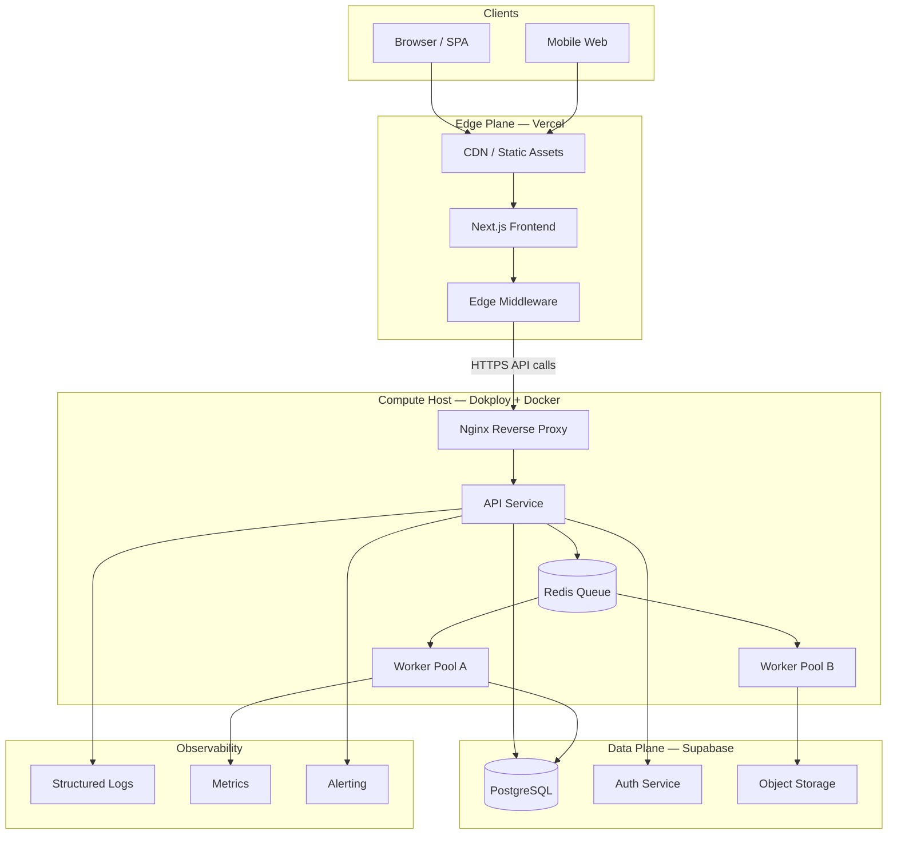
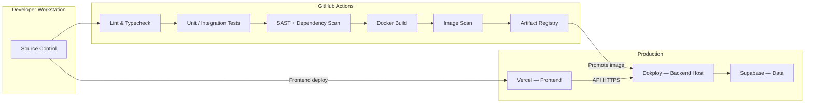
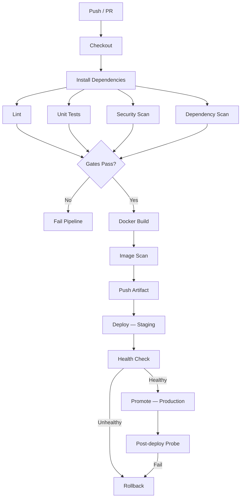
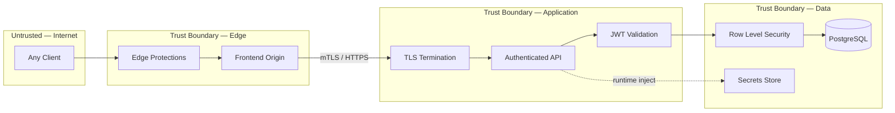
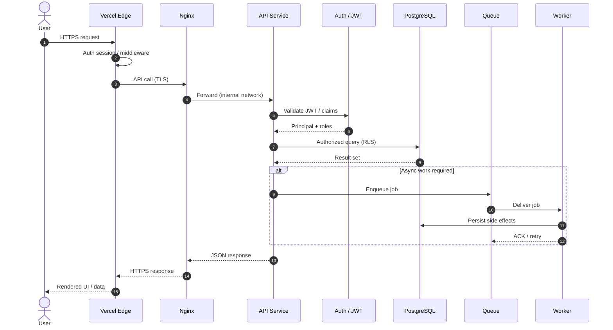

# Licitera — Architecture Showcase

Documentação de arquitetura, DevOps e segurança do Licitera — um SaaS de inteligência em compras públicas.

---

> [!IMPORTANT]
> **Este repositório é um portfólio de arquitetura — não o código de produção.**
> Aqui estão documentação sanitizada, registros de decisão (ADRs), modelos C4 e *templates* de configuração.
> Não há lógica de negócio proprietária, credenciais, schemas reais nem endpoints ao vivo.

---

## O que é o Licitera

O **Licitera** é um SaaS em produção para **inteligência em compras públicas**: monitoramento de editais, processamento de dados legislativos e de avisos, e automação de fluxos para times que precisam de sinais estruturados e em tempo hábil a partir de fontes públicas.

Este repositório mostra o **sistema de engenharia por trás** — como os serviços se separam, como os deploys ficam seguros, como a segurança é empilhada em camadas, e quais trade-offs fizemos em cada fase.

| Quem lê | O que encontra |
|---|---|
| Gestores / entrevistas Staff+ | Qualidade de decisão, fluência em trade-offs, pensamento operacional |
| Revisores de segurança | Modelo STRIDE, defesa em profundidade, controles de supply chain |
| Pares de Platform / SRE | CI/CD, postura de HA, metas de DR, estratégia de observabilidade |
| Arquitetos | Visões C4, ADRs, escalabilidade e domínios de falha |

---

## Destaques de engenharia

### Arquitetura

- Fronteiras claras entre UI na edge, API, workers e o plano de dados
- Camada de aplicação **stateless** — o estado durável fica no PostgreSQL / object storage
- Processamento assíncrono baseado em **fila** para ingestão e jobs longos
- Isolamento de falha por containers e reinícios independentes
- Documentado com **C4** e **ADRs** — veja [`docs/`](docs/)

### Segurança

- **Defesa em profundidade**: edge → reverse proxy → app → RLS → isolamento de secrets
- Auth com JWT, autorização de menor privilégio e Row Level Security
- Controles de supply chain: scan de dependências, scan de imagem, pipeline orientado a SBOM
- Containers endurecidos, segmentação de rede, mitigações do OWASP Top 10
- Threat model completo em **STRIDE** — [`docs/THREAT_MODEL.md`](docs/THREAT_MODEL.md)

### Infraestrutura

- **Docker** como unidade de deploy; **Dokploy** para orquestração no host
- **Vercel Edge** para o frontend Next.js (CDN + edge runtime)
- **Supabase / PostgreSQL** como plano de dados gerenciado
- **Nginx** como reverse proxy com terminação TLS no host de compute
- Templates sanitizados em [`config-templates/`](config-templates/)

### DevOps

- **GitHub Actions** com gates de lint → teste → security scan → build → deploy
- Versionamento imutável de imagens e retenção de artefatos
- Promoção com health check e caminho explícito de rollback
- Promoção entre ambientes sem compartilhar secrets entre estágios

### Escalabilidade

- Scale-out horizontal de réplicas de API e workers
- Connection pooling e pools de workers sensíveis à profundidade da fila
- Cache na edge e na aplicação
- Caminho documentado rumo ao Kubernetes quando a pressão operacional justificar

### Confiabilidade

- Health checks, restart policies e rolling updates
- Metas de **RPO / RTO** e runbooks de backup/restore
- Domínios de falha pensados para que um worker cair não derrube a API
- Base de observabilidade com caminho claro para OpenTelemetry

---

## Diagramas Mermaid

### Arquitetura geral

### Deploy

### Pipeline de CI/CD

### Fronteiras de segurança

### Ciclo de vida de uma request

---

## Decisões de engenharia

| Decisão | Por quê | Trade-off principal |
|---|---|---|
| **Docker em vez de Kubernetes** | Caminho mais rápido até produção; carga operacional cabe no time | Menos HPA / service mesh nativos — até precisar |
| **Dokploy em vez de orquestração caseira** | Deploys declarativos, health e rollback sem montar um PaaS próprio | Acoplamento à plataforma; saída via imagens Docker padrão |
| **Vercel Edge no frontend** | CDN global, preview deploys, pouco ops no Next.js | Backend fica em compute dedicado para jobs longos |
| **PostgreSQL** | Integridade relacional, RLS, ecossistema maduro | Exige cuidado com índices e connection pool |
| **Supabase** | Postgres + Auth + Storage gerenciados, com RLS | Fronteira de vendor — abstraímos via repositories |
| **GitHub Actions** | Nativo ao controle de versão; ecossistema de actions de segurança | Planejar minutos de runner e concorrência |
| **Rede Docker** | Redes bridge explícitas; alcance mínimo entre serviços | Políticas de rede precisam ser documentadas e testadas |
| **Backend stateless** | Scale horizontal simples; recuperação limpa | Sessão/estado vão para DB / cache |
| **Processamento por fila** | Isola trabalho lento/IO do caminho da request | Consistência eventual; idempotência obrigatória |

Detalhes: [`docs/ADR/`](docs/ADR/) · [`docs/TECHNOLOGY_CHOICES.md`](docs/TECHNOLOGY_CHOICES.md)

---

## Navegação do repositório

| Caminho | O que tem |
|---|---|
| [`docs/ARCHITECTURE.md`](docs/ARCHITECTURE.md) | Design do sistema, fronteiras, fluxos, HA |
| [`docs/DEVOPS_AND_CICD.md`](docs/DEVOPS_AND_CICD.md) | Pipelines, versionamento, deploy, rollback |
| [`docs/SECURITY_AND_COMPLIANCE.md`](docs/SECURITY_AND_COMPLIANCE.md) | AuthZ, OWASP, supply chain, LGPD |
| [`docs/OBSERVABILITY.md`](docs/OBSERVABILITY.md) | Logs, métricas, tracing, resposta a incidentes |
| [`docs/SCALABILITY.md`](docs/SCALABILITY.md) | Scale horizontal, pools, cache, caminho K8s |
| [`docs/PERFORMANCE.md`](docs/PERFORMANCE.md) | Edge, CDN, DB, otimização assíncrona |
| [`docs/DISASTER_RECOVERY.md`](docs/DISASTER_RECOVERY.md) | Backups, RPO/RTO, continuidade |
| [`docs/THREAT_MODEL.md`](docs/THREAT_MODEL.md) | STRIDE: assets, atores, mitigações |
| [`docs/TECHNOLOGY_CHOICES.md`](docs/TECHNOLOGY_CHOICES.md) | Por que cada tecnologia foi escolhida |
| [`docs/ADR/`](docs/ADR/) | Architecture Decision Records |
| [`docs/C4/`](docs/C4/) | Visões Context, Container e Component |
| [`config-templates/`](config-templates/) | Compose, Nginx, Prometheus e env sanitizados |
| [`ROADMAP.md`](ROADMAP.md) | Evolução de curto e longo prazo |

---

## Roadmap

No curto prazo: **OpenTelemetry**, **canary releases**, **Secrets Manager** e **Terraform**. Mais à frente, avaliamos **Kubernetes**, **blue/green** e **DR multi-região** quando as métricas justificarem o custo operacional. Detalhe em [`ROADMAP.md`](ROADMAP.md).

---

## Autor

**Alisson Oliveira** — engenheiro de software construindo sistemas de inteligência em compras públicas em produção.

- GitHub: [@alissonf216](https://github.com/alissonf216)
- LinkedIn: *[adicionar URL do perfil]*

---

## Licença

Publicado sob a [MIT License](LICENSE). Documentação e templates são para fins educacionais e de portfólio.
