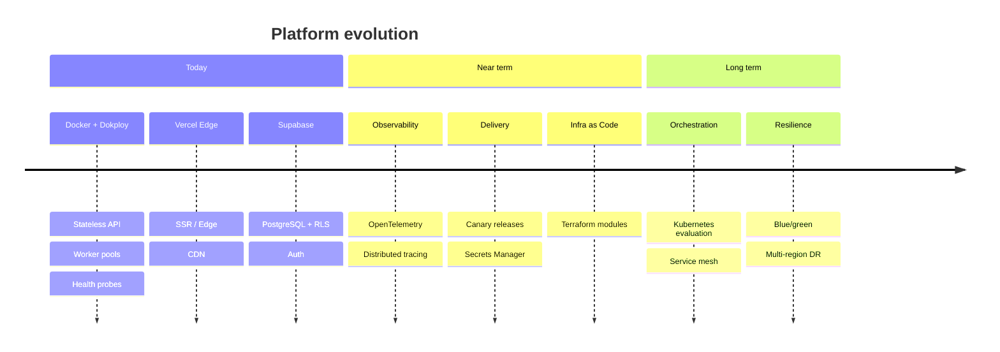
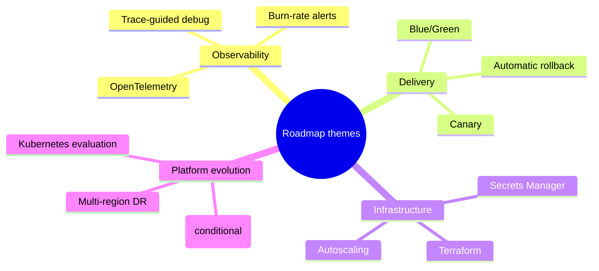

# Roadmap

> **Language:** English · [Português (Brasil)](ROADMAP-pt-br.md)

This roadmap describes how the Licitech platform should evolve in architecture and operations. It is intentionally high-level and independent of any proprietary implementation.

---

## Where we are today

| Capability | Status | Notes |
|---|---|---|
| Containerized API and workers | ✅ In production | Docker Compose + Dokploy |
| Frontend on the edge (Vercel) | ✅ In production | Next.js on the Edge Network |
| Managed PostgreSQL (Supabase) | ✅ In production | Data plane with RLS |
| CI on GitHub Actions | ✅ In production | Lint, test, scan, build |
| Structured logs | ✅ In production | JSON → aggregation |
| Health checks and restart policies | ✅ In production | Per-container probes |
| Async queue processing | ✅ In production | Workers with Redis |
| Layered security | ✅ In production | See [SECURITY_AND_COMPLIANCE.md](docs/SECURITY_AND_COMPLIANCE.md) |

---

## Near term (0–6 months)

### Real observability

- Adopt **OpenTelemetry** for traces, metrics, and logs under the same correlation model
- Distributed tracing on the API → queue → worker → database path
- Define SLOs (availability, p95/p99 latency, error budget) and alert on burn rate

### Safer delivery

- **Canary releases** for backend images (promotion with traffic weighting)
- Automatic **rollback** when the post-deploy health check fails
- Centralized **Secrets Manager** (move off host env files)

### Infrastructure as code

- Terraform modules (or equivalent) to:
  - provision the compute host
  - DNS / TLS certificates
  - monitoring stack
  - network ACLs
- Drift detection against declared state

### Security hardening

- Continuous SBOM generation and vulnerability SLAs
- Automatic dependency PRs with policy gates
- Secret scanning in CI (partially present — broaden coverage)

> [!NOTE]
> In the near term, we prioritize **operational signal quality** and **deploy safety** — not new product features.

---

## Long term (6–18 months)

### Orchestration evolution

| Option | When to evaluate | Expected benefit |
|---|---|---|
| Stay with Docker + Dokploy | Traffic and ops still fit the team | Lower operational overhead |
| Managed Kubernetes | Many services, HPA, multi-region | Declarative scheduling, richer networking |
| Hybrid | Edge on Vercel; data plane on K8s | Incremental migration |

[ADR 0001](docs/ADR/0001-docker-over-kubernetes.md) records the original decision and exit criteria.

### Blue / green deploy

- Two environment slots with atomic traffic switch
- Database migrations in the dual-write / expand-contract pattern
- Instant rollback via DNS or load balancer

### Service mesh (only if it pays off)

- Evaluate only if east-west traffic volume and mTLS requirements justify control-plane cost
- Lightweight candidates (sidecar or ambient) — decide after the K8s path

### Multi-region disaster recovery

- Cross-region PostgreSQL replicas (or restore via PITR in a secondary region)
- Active/passive frontend failover
- Stretch targets: RPO ≤ 1 h / RTO ≤ 4 h (see [DISASTER_RECOVERY.md](docs/DISASTER_RECOVERY.md))

---

## Improvements on the radar

| Area | Improvement | Value |
|---|---|---|
| Autoscaling | Scale workers by CPU / queue depth | Absorb ingestion spikes without overprovisioning |
| Cache | Multi-layer (edge + app + Redis) | Lower p95 on hot reads |
| Data | Read replicas for analytics | Isolate OLTP from reporting |
| Security | Hardware-backed key management | Stronger key lifecycle |
| Compliance | Formal DPIA review cadence (LGPD) | Continuous regulatory alignment |
| Performance | Query-plan budget in CI | Prevent slow-query regressions |
| DX | ADR bot | Require ADRs on material changes |
| Chaos | Controlled failure injection | Validate blast-radius hypotheses |

---

## What we explicitly will *not* do in this horizon

- Rewrite the platform on another stack
- Abstract multi-cloud too early
- Adopt Kubernetes without measurable operational pressure
- Build a custom orchestrator

---

## Decision gates

Every major roadmap item must pass:

1. **Clear problem** — measurable pain or risk
2. **ADR** — alternatives and trade-offs recorded
3. **Operational readiness** — runbooks, alerts, rollback
4. **Security review** — delta to the threat model
5. **Cost model** — steady-state and peak

---

## Related documents

- [ARCHITECTURE.md](docs/ARCHITECTURE.md)
- [DEVOPS_AND_CICD.md](docs/DEVOPS_AND_CICD.md)
- [SCALABILITY.md](docs/SCALABILITY.md)
- [DISASTER_RECOVERY.md](docs/DISASTER_RECOVERY.md)
- [ADR index](docs/ADR/)
