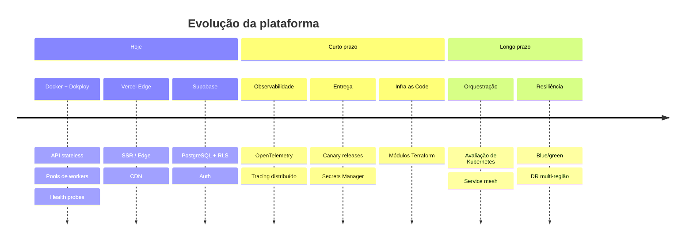
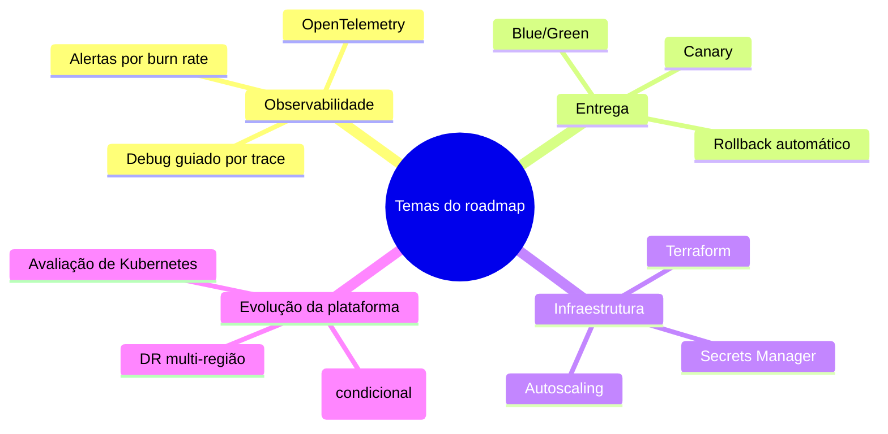

# Roadmap

Este roadmap descreve como a plataforma Licitera deve evoluir em arquitetura e operação. É propositalmente alto nível e independente de qualquer implementação proprietária.

---

## Onde estamos hoje

| Capacidade | Status | Notas |
|---|---|---|
| API e workers containerizados | ✅ Em produção | Docker Compose + Dokploy |
| Frontend na edge (Vercel) | ✅ Em produção | Next.js na Edge Network |
| PostgreSQL gerenciado (Supabase) | ✅ Em produção | Plano de dados com RLS |
| CI no GitHub Actions | ✅ Em produção | Lint, teste, scan, build |
| Logs estruturados | ✅ Em produção | JSON → agregação |
| Health checks e restart policies | ✅ Em produção | Probes por container |
| Processamento assíncrono por fila | ✅ Em produção | Workers com Redis |
| Segurança em camadas | ✅ Em produção | Ver [SECURITY_AND_COMPLIANCE.md](docs/SECURITY_AND_COMPLIANCE.md) |

---

## Curto prazo (0–6 meses)

### Observabilidade de verdade

- Adotar **OpenTelemetry** para traces, métricas e logs com o mesmo modelo de correlação
- Tracing distribuído no caminho API → fila → worker → banco
- Definir SLOs (disponibilidade, latência p95/p99, error budget) e alertar por burn rate

### Entrega mais segura

- **Canary releases** nas imagens de backend (promoção com peso de tráfego)
- **Rollback** automático quando o health check pós-deploy falhar
- **Secrets Manager** centralizado (sair de env files no host)

### Infraestrutura como código

- Módulos Terraform (ou equivalente) para:
  - provisionar o host de compute
  - DNS / certificados TLS
  - stack de monitoramento
  - network ACLs
- Detecção de drift contra o estado declarado

### Endurecimento de segurança

- Geração contínua de SBOM e SLAs de vulnerabilidade
- PRs automáticos de dependências com gates de política
- Scan de secrets no CI (já existe em parte — ampliar cobertura)

> [!NOTE]
> No curto prazo, priorizamos **qualidade do sinal operacional** e **segurança de deploy** — não features de produto novas.

---

## Longo prazo (6–18 meses)

### Evolução da orquestração

| Opção | Quando avaliar | Benefício esperado |
|---|---|---|
| Continuar com Docker + Dokploy | Tráfego e ops ainda cabem no time | Menor overhead operacional |
| Kubernetes gerenciado | Muitos serviços, HPA, multi-região | Scheduling declarativo, rede mais rica |
| Híbrido | Edge no Vercel; data plane no K8s | Migração incremental |

O [ADR 0001](docs/ADR/0001-docker-over-kubernetes.md) registra a decisão original e os critérios de saída.

### Deploy blue / green

- Dois slots de ambiente com troca atômica de tráfego
- Migrações de banco no padrão dual-write / expand-contract
- Rollback instantâneo por DNS ou load balancer

### Service mesh (só se fizer sentido)

- Avaliar só se o volume de tráfego east-west e a exigência de mTLS pagarem o custo do control plane
- Candidatos leves (sidecar ou ambient) — decidir depois do caminho K8s

### Disaster recovery multi-região

- Réplicas de PostgreSQL cross-region (ou restore via PITR numa região secundária)
- Failover ativo/passivo do frontend
- Metas alongadas: RPO ≤ 1 h / RTO ≤ 4 h (ver [DISASTER_RECOVERY.md](docs/DISASTER_RECOVERY.md))

---

## Melhorias em radar

| Área | Melhoria | Valor |
|---|---|---|
| Autoscaling | Scale de workers por CPU / profundidade da fila | Absorver picos de ingestão sem overprovisionar |
| Cache | Multi-camada (edge + app + Redis) | Baixar p95 em leituras quentes |
| Dados | Read replicas para analytics | Isolar OLTP de reporting |
| Segurança | Gestão de chaves com hardware | Ciclo de vida de chave mais forte |
| Compliance | Ritmo formal de revisão de DPIA (LGPD) | Alinhamento regulatório contínuo |
| Performance | Budget de query plan no CI | Evitar regressão de queries lentas |
| DX | Bot de ADR | Exigir ADR em mudanças relevantes |
| Chaos | Injeção controlada de falha | Validar hipóteses de blast radius |

---

## O que explicitamente *não* vamos fazer neste horizonte

- Reescrever a plataforma em outra stack
- Abstrair multi-cloud cedo demais
- Adotar Kubernetes sem pressão operacional mensurável
- Construir um orquestrador próprio

---

## Gates de decisão

Toda item grande do roadmap precisa passar por:

1. **Problema claro** — dor ou risco mensurável
2. **ADR** — alternativas e trade-offs registrados
3. **Prontidão operacional** — runbooks, alertas, rollback
4. **Revisão de segurança** — delta no threat model
5. **Modelo de custo** — steady-state e pico

---

## Documentos relacionados

- [ARCHITECTURE.md](docs/ARCHITECTURE.md)
- [DEVOPS_AND_CICD.md](docs/DEVOPS_AND_CICD.md)
- [SCALABILITY.md](docs/SCALABILITY.md)
- [DISASTER_RECOVERY.md](docs/DISASTER_RECOVERY.md)
- [Índice de ADRs](docs/ADR/)
