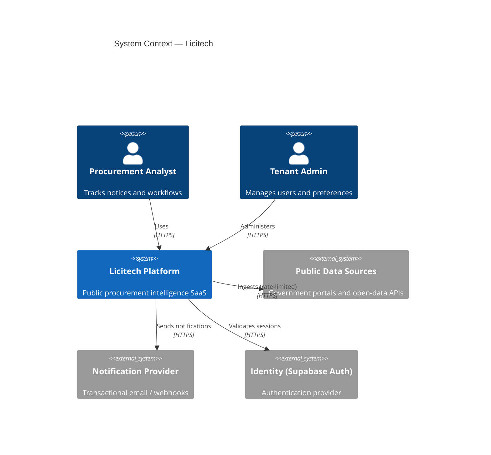
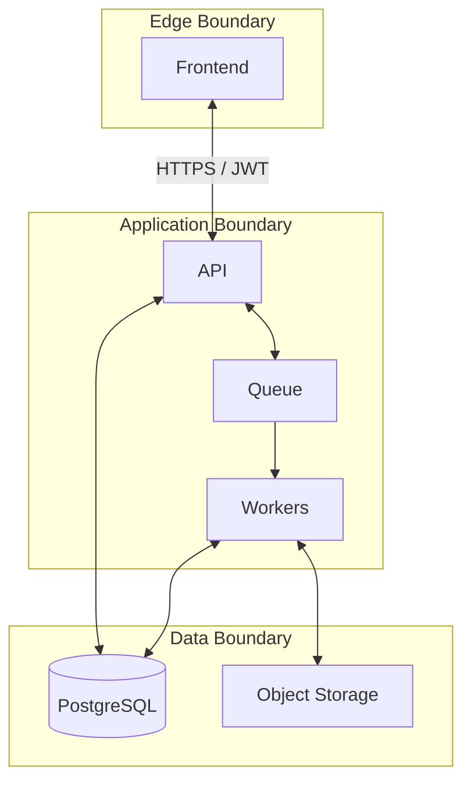
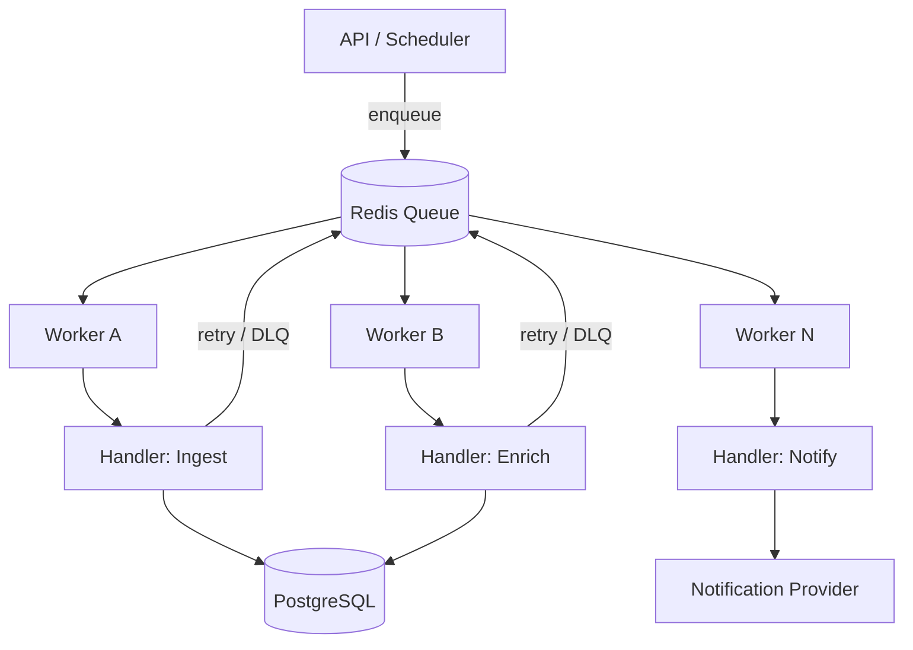
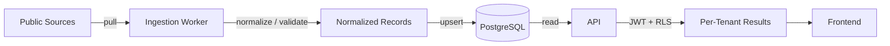
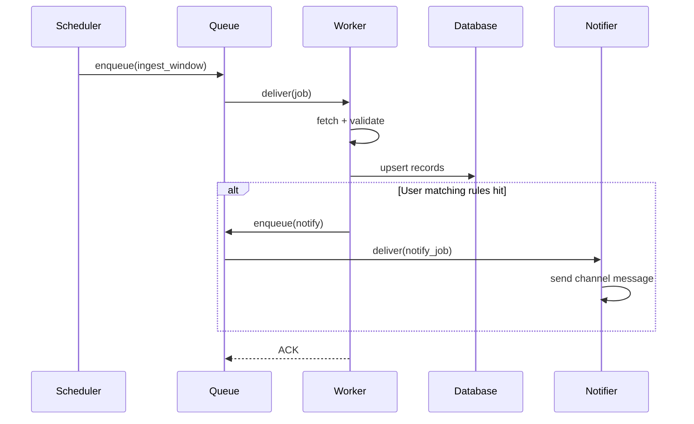
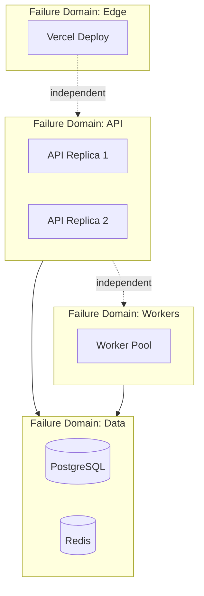
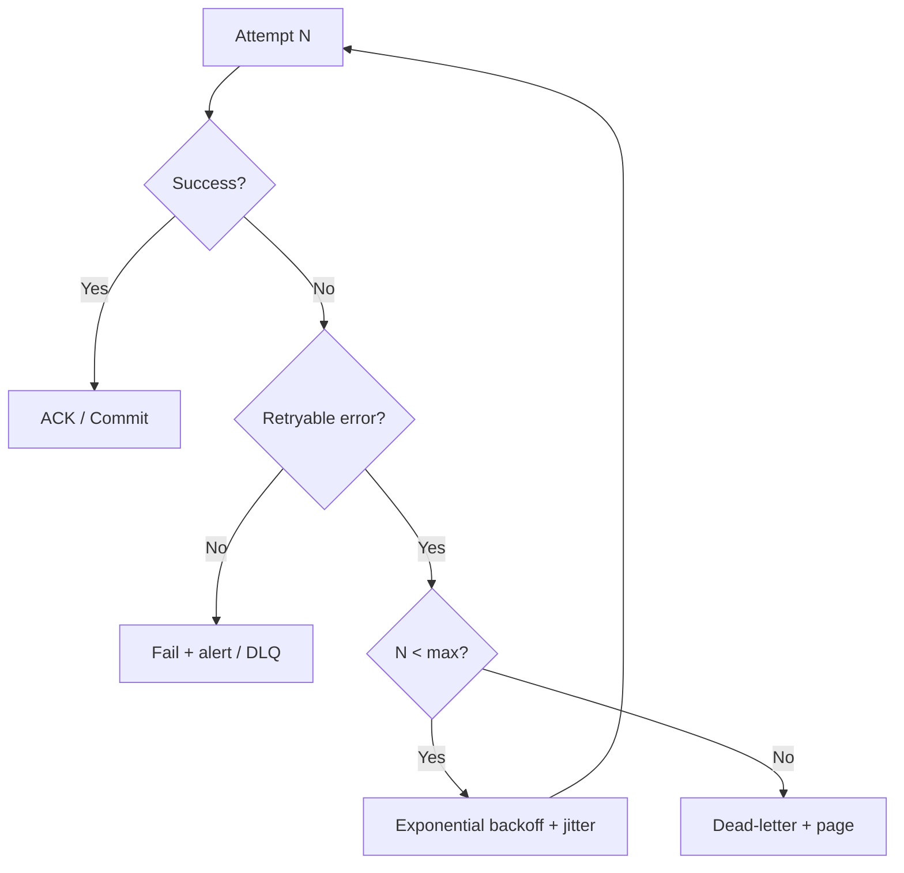
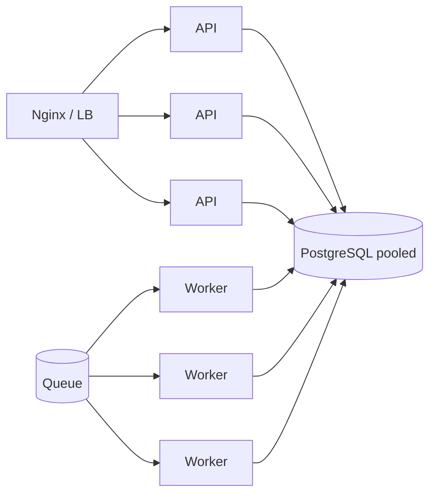

# Architecture

> **Language:** English · [Português (Brasil)](pt-br/ARCHITECTURE.md)

> Sanitized architecture documentation: no proprietary schemas, real endpoints, or implementation details.

---

## 1. System context

Licitech is a multi-tenant SaaS that aggregates and organizes **public procurement signals** (notices, announcements, legislative references) and surfaces them through authenticated web flows.

> [!NOTE]
> External source adapters are treated as **untrusted I/O**. All ingested content is validated, normalized, and stored under per-tenant policies before it reaches the user.

---

## 2. Service boundaries

| Boundary | Responsibility | Failure isolation |
|---|---|---|
| **Edge UI** | Rendering, client routing, edge auth gates | Degraded UI without stalling workers |
| **API** | Synchronous commands/queries, authZ | Restarts independently of workers |
| **Workers** | Ingestion, enrichment, notifications | Crash loops do not take down the API |
| **Queue** | Buffer and retry semantics | Back-pressure protects upstream sources |
| **Data plane** | Durable state, RLS, storage | PITR / backups independent of compute |

---

## 3. Backend components

| Component | Role | State |
|---|---|---|
| **API process** | REST/JSON (or RPC) surface; validation; orchestration | Stateless |
| **Auth middleware** | JWT verification, claim extraction, tenant binding | Stateless |
| **Domain services** | Use-case orchestration (no direct SQL in controllers) | Stateless |
| **Repository layer** | Persistence abstraction | Stateless |
| **Worker runners** | Consume jobs; idempotent handlers | Stateless |
| **Scheduler / poller** | Enqueues periodic ingestion windows | Stateless |

> [!TIP]
> Controllers stay thin. Domain rules live in services. Persistence is swappable behind repositories — so Supabase/Postgres remains a data-plane implementation detail.

---

## 4. Worker architecture

Workers are **horizontally scalable processes** consuming from a shared queue.

**Design rules**

1. **Idempotency keys** on every job — we assume at-least-once delivery
2. **Bounded retries** with exponential backoff + jitter
3. **Dead-letter** path for poison messages after max attempts
4. **Visibility timeout** so crashed workers do not leave orphaned jobs
5. **No shared mutable memory** across workers

---

## 5. Data flow

**Principles**

- The write path is append/upsert-oriented; updates are auditable when needed
- The read path is filtered by RLS in the database — application filters are the second line, not the only one
- Large payloads (attachments, raw snapshots) go to object storage; the DB holds references and metadata

---

## 6. Event flow

Events are **commands on a queue**, not a full event bus — chosen for operational simplicity at the current scale. See the [ADR roadmap](../ROADMAP.md) for when a richer event backbone would be worth reconsidering.

---

## 7. Queue processing

| Concern | Approach |
|---|---|
| Delivery | At-least-once |
| Ordering | Per partition / per entity key when required; otherwise best-effort |
| Back-pressure | Queue-depth metrics → scale workers / drop non-critical jobs |
| Poison messages | Max retries → dead-letter + alert |
| Observability | Job ID correlation in logs: API → queue → worker |

---

## 8. Stateless design

All application processes are **stateless**:

- No in-process session store
- No sticky sessions at the load balancer
- Configuration via environment (injected at runtime)
- Horizontal scale = replica count

Durable state:

| Store | Contents |
|---|---|
| PostgreSQL | Canonical entities, tenancy, authz attributes |
| Redis | Queue / short-lived cache / rate-limit counters |
| Object storage | Blobs and raw artifacts |

---

## 9. Failure isolation

| Failure | Blast radius | Mitigation |
|---|---|---|
| Single API container crash | In-flight requests on that replica | Restart policy + multi-replica |
| Worker pool saturation | Delayed async jobs | Scale out; drop low-priority work |
| Redis unavailable | Queue pauses | Alerts; degraded mode (sync-critical paths only, if defined) |
| Postgres unavailable | Full read/write outage | Fail closed; backup restore / PITR |

---

## 10. Rate limiting

| Layer | Mechanism | Purpose |
|---|---|---|
| Edge | Platform rules / WAF | Volumetric abuse |
| API | Per-token / IP / tenant budgets | Fair use and cost control |
| Workers | Per-source politeness limits | Protect upstream public APIs |
| Database | Pool caps | Avoid connection storms |

When a limit is exceeded, we return explicit, retry-friendly errors (e.g. `429` with `Retry-After` semantics when applicable).

---

## 11. Retry strategy

- Distinguish **transient** (timeouts, 503) from **permanent** (validation, 404)
- Cap total attempts; never infinite retry on the hot path
- Idempotency tokens prevent duplicated side effects

---

## 12. High availability

| Layer | HA posture |
|---|---|
| Frontend | Multi-AZ edge network (Vercel) |
| API | N ≥ 2 replicas behind reverse proxy |
| Workers | N ≥ 2; the queue absorbs short outages |
| PostgreSQL | Managed HA / automatic failover (provider) |
| Redis | Persistence mode matched to queue durability needs |

Health endpoints (`/health/live`, `/health/ready`) control traffic and orchestrator restarts.

---

## 13. Horizontal scale

Scale triggers (manual today; automated on the roadmap):

- API: CPU / p95 latency / RPS
- Workers: queue depth / lag / job age

---

## 14. Failure domains — summary

| Domain | Contains | Independent restart? |
|---|---|---|
| Edge | Next.js deploy | Yes |
| Proxy | Nginx | Yes |
| API | Application containers | Yes |
| Workers | Job consumers | Yes |
| Cache/Queue | Redis | Yes (with queue-drain risk) |
| Data | PostgreSQL + storage | Restore-oriented |

---

## Related documents

- [C4 Context](C4/CONTEXT.md) · [Container](C4/CONTAINER.md) · [Component](C4/COMPONENT.md)
- [SCALABILITY.md](SCALABILITY.md) · [PERFORMANCE.md](PERFORMANCE.md)
- [THREAT_MODEL.md](THREAT_MODEL.md) · [ADR/](ADR/)
