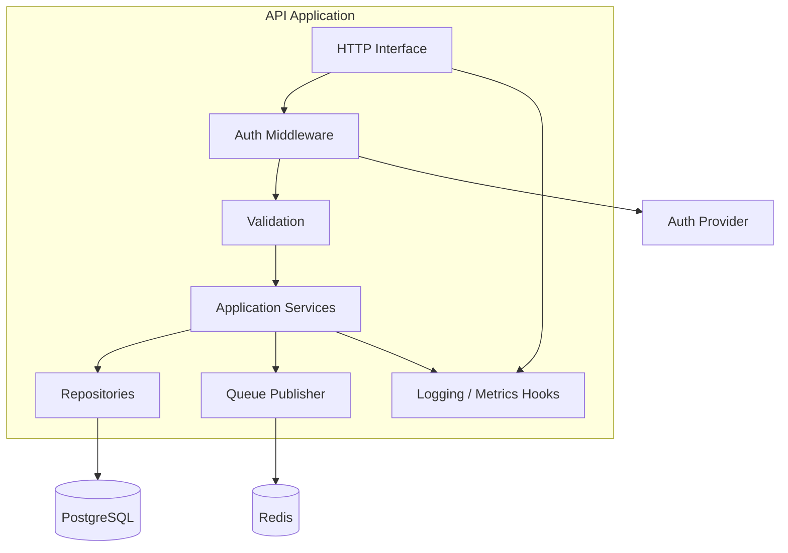
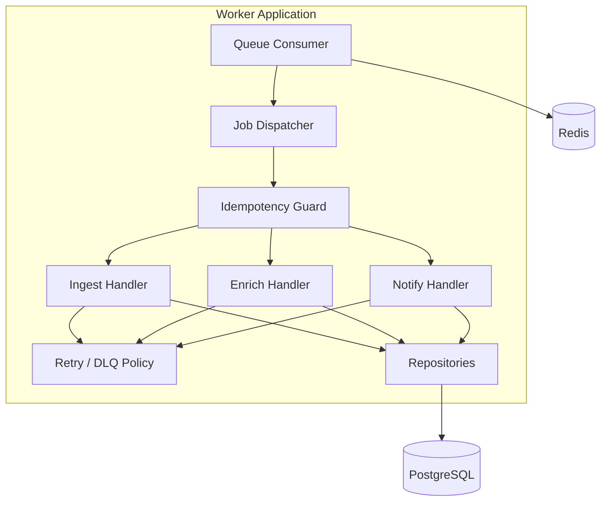
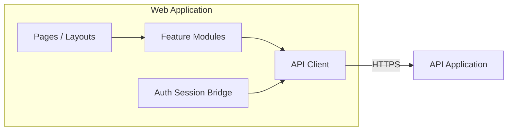

# C4 — Components

> **Language:** English · [Português (Brasil)](../pt-br/C4/COMPONENT.md)

> **Level 3.** Main blocks inside the API and Workers. Conceptual — not a dump of the source tree.

---

## Purpose

Explain the **separation of responsibilities** internally, without proprietary module names or business algorithms.

---

## API components

| Component | Responsibility |
|---|---|
| HTTP Interface | Routing, status codes, serialization |
| Auth Middleware | JWT validation, principal extraction |
| Validation | Schema checks; reject malformed input early |
| Application Services | Use-case orchestration |
| Repositories | Persistence abstraction |
| Queue Publisher | Enqueue jobs with idempotency keys |
| Observability Hooks | Correlation IDs, RED metrics |

---

## Worker components

| Component | Responsibility |
|---|---|
| Queue Consumer | Lease jobs; heartbeat; ACK/NACK |
| Job Dispatcher | Routing by job type |
| Handlers | Near-pure use cases for each job family |
| Idempotency Guard | Skip duplicate side effects |
| Retry / DLQ Policy | Backoff; dead-letter; alert |
| Repositories | Same persistence boundary as the API |

---

## Frontend components (simplified)

---

## Cross-component design rules

1. **No SQL in HTTP handlers** — repositories only
2. **No HTTP in workers** for core domain writes — handlers call repositories/services
3. **Idempotency** is mandatory on every job handler
4. **AuthZ checks** happen in services *and* in RLS
5. **Secrets** never travel in job payloads when avoidable — fetch at runtime

---

## Related

- [CONTAINER.md](CONTAINER.md)
- [ARCHITECTURE.md](../ARCHITECTURE.md)
- [SECURITY_AND_COMPLIANCE.md](../SECURITY_AND_COMPLIANCE.md)
