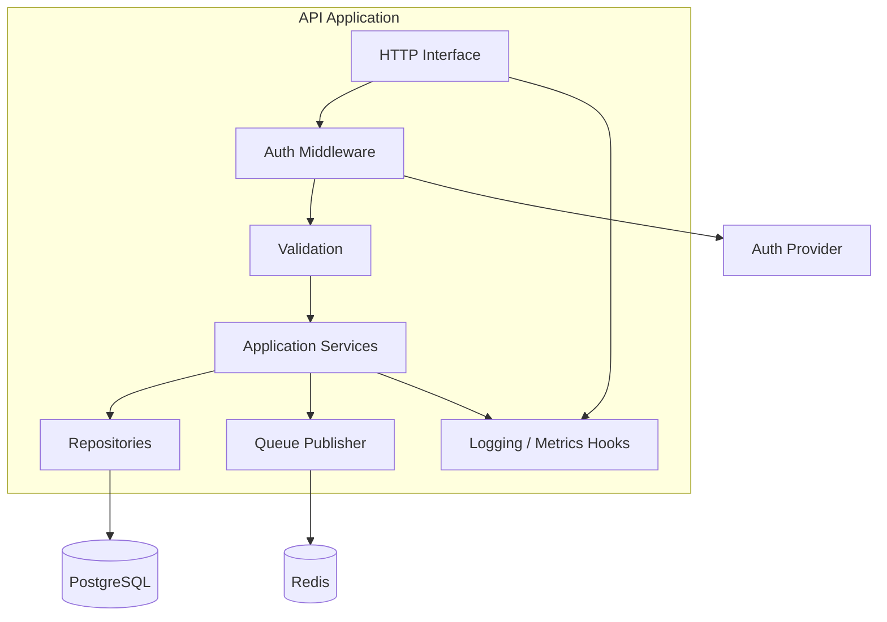
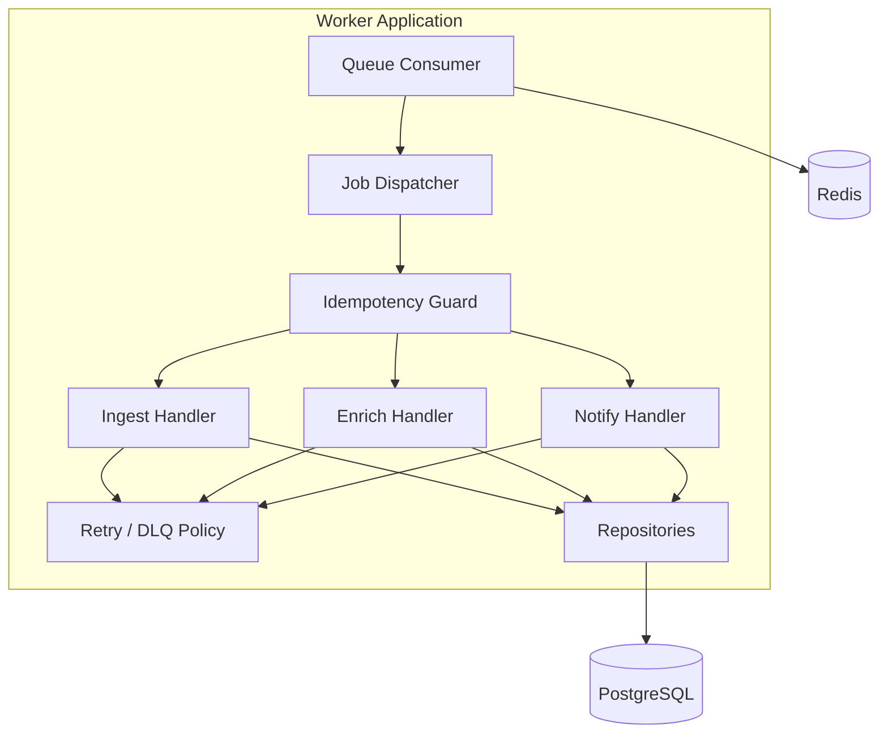
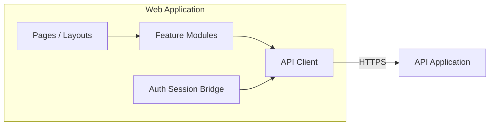

# C4 — Components

> **Nível 3.** Blocos principais dentro da API e dos Workers. Conceitual — não é dump da árvore de código.

---

## Para que serve

Explicar a **separação de responsabilidades** por dentro, sem nomes de módulos proprietários nem algoritmos de negócio.

---

## Componentes da API

| Componente | Responsabilidade |
|---|---|
| HTTP Interface | Roteamento, status codes, serialização |
| Auth Middleware | Validação de JWT, extração do principal |
| Validation | Checagem de schema; rejeitar input malformado cedo |
| Application Services | Orquestração de use cases |
| Repositories | Abstração de persistência |
| Queue Publisher | Enfileirar jobs com idempotency keys |
| Observability Hooks | Correlation IDs, métricas RED |

---

## Componentes dos Workers

| Componente | Responsabilidade |
|---|---|
| Queue Consumer | Fazer lease de jobs; heartbeat; ACK/NACK |
| Job Dispatcher | Roteamento por tipo de job |
| Handlers | Use cases quase puros para cada família de job |
| Idempotency Guard | Pular side effects duplicados |
| Retry / DLQ Policy | Backoff; dead-letter; alerta |
| Repositories | Mesma fronteira de persistência da API |

---

## Componentes do frontend (simplificado)

---

## Regras de design entre componentes

1. **Sem SQL em HTTP handlers** — só repositories
2. **Sem HTTP em workers** para writes de domínio core — handlers chamam repositories/services
3. **Idempotency** é obrigatória em todo job handler
4. **Checagens de AuthZ** acontecem nos services *e* no RLS
5. **Secrets** nunca passam em payloads de job quando dá para evitar — buscar em runtime

---

## Relacionados

- [CONTAINER.md](CONTAINER.md)
- [ARCHITECTURE.md](../ARCHITECTURE.md)
- [SECURITY_AND_COMPLIANCE.md](../SECURITY_AND_COMPLIANCE.md)
