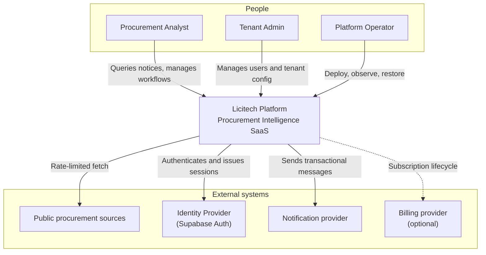

# C4 — System Context

> **Language:** English · [Português (Brasil)](../pt-br/C4/CONTEXT.md)

> **Level 1.** Who uses Licitech and which external systems it talks to. No internal technology detail.

---

## Purpose

Show **who** uses the system and **which external systems** it depends on, without revealing proprietary adapters or production endpoints.

---

## Context diagram

---

## Actors

| Actor | Goals | Where they interact |
|---|---|---|
| Procurement Analyst | Find relevant notices; track workflows | Web application |
| Tenant Admin | Control access in the organization | Admin settings |
| Platform Operator | Keep the service up and secure | CI/CD, observability, DR runbooks |

---

## External systems

| System | Relationship | Trust |
|---|---|---|
| Public data sources | Inbound data (pull) | Untrusted content |
| Identity provider | AuthN | Trusted IdP — we still validate tokens |
| Notification provider | Outbound messages | Authenticated API |
| Billing provider | Commercial lifecycle | Least-privilege integration |

---

## Invariants

1. Users never connect directly to the database
2. Content from public sources is untrusted until validated
3. Operators use break-glass paths that are audited

---

## Related

- [CONTAINER.md](CONTAINER.md) — next level of detail
- [ARCHITECTURE.md](../ARCHITECTURE.md)
- [THREAT_MODEL.md](../THREAT_MODEL.md)
