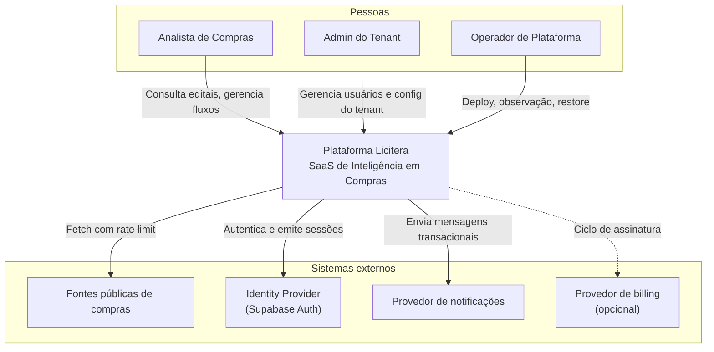

# C4 — System Context

> **Nível 1.** Quem usa a Licitera e com quais sistemas externos ela conversa. Sem detalhe interno de tecnologia.

---

## Para que serve

Mostrar **quem** usa o sistema e **de quais sistemas externos** ele depende, sem revelar adapters proprietários ou endpoints de produção.

---

## Diagrama de contexto

---

## Atores

| Ator | Objetivos | Onde interage |
|---|---|---|
| Analista de Compras | Encontrar editais relevantes; acompanhar workflows | Aplicação web |
| Admin do Tenant | Controlar acesso na organização | Configurações de admin |
| Operador de Plataforma | Manter o serviço no ar e seguro | CI/CD, observabilidade, runbooks de DR |

---

## Sistemas externos

| Sistema | Relação | Confiança |
|---|---|---|
| Fontes públicas de dados | Dados de entrada (pull) | Conteúdo não confiável |
| Identity provider | AuthN | IdP confiável — ainda assim validamos tokens |
| Provedor de notificações | Mensagens de saída | API autenticada |
| Provedor de billing | Ciclo comercial | Integração com least privilege |

---

## Invariantes

1. Usuários nunca conectam direto no banco
2. Conteúdo de fontes públicas é não confiável até ser validado
3. Operadores usam caminhos break-glass que são auditados

---

## Relacionados

- [CONTAINER.md](CONTAINER.md) — próximo nível de detalhe
- [ARCHITECTURE.md](../ARCHITECTURE.md)
- [THREAT_MODEL.md](../THREAT_MODEL.md)
