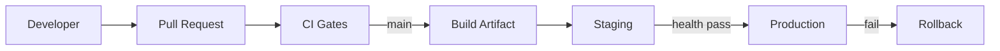
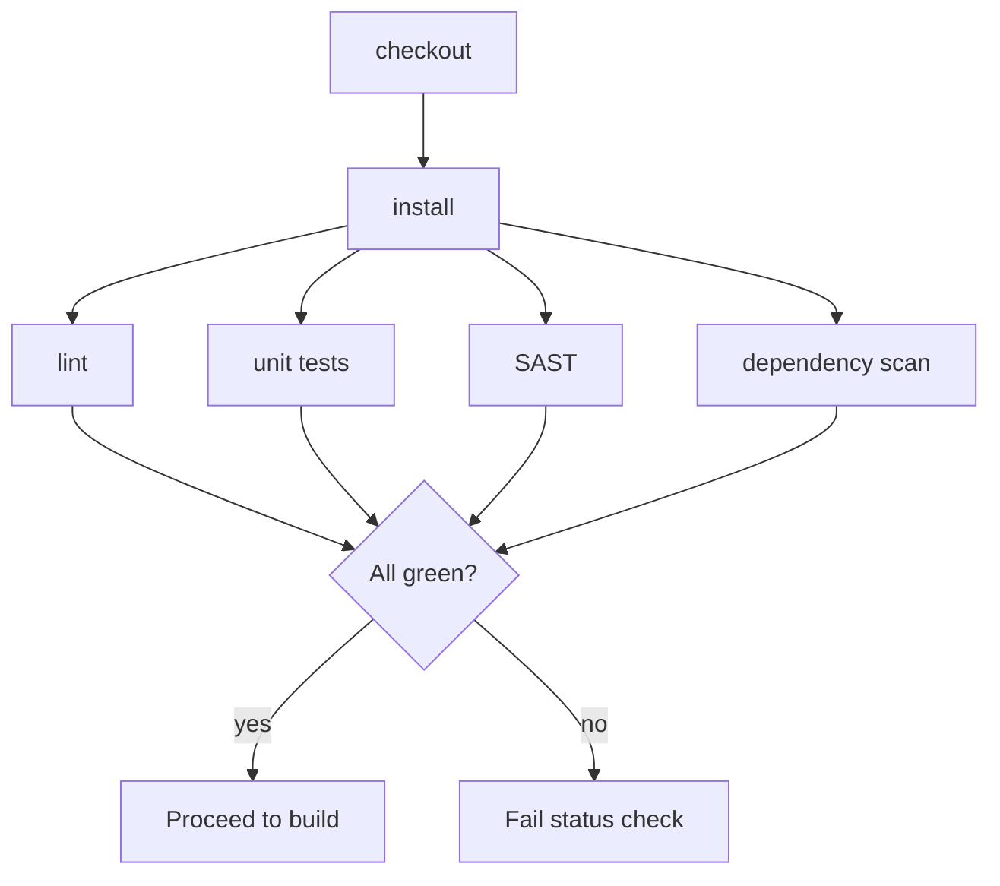
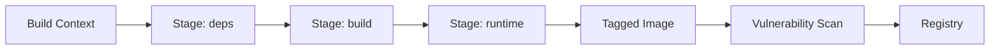
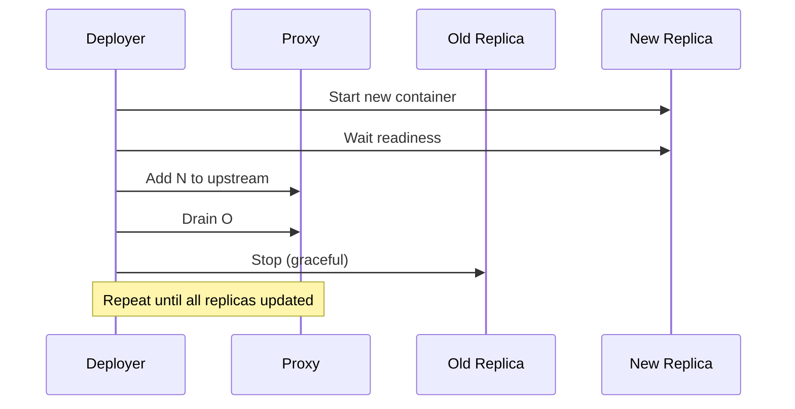
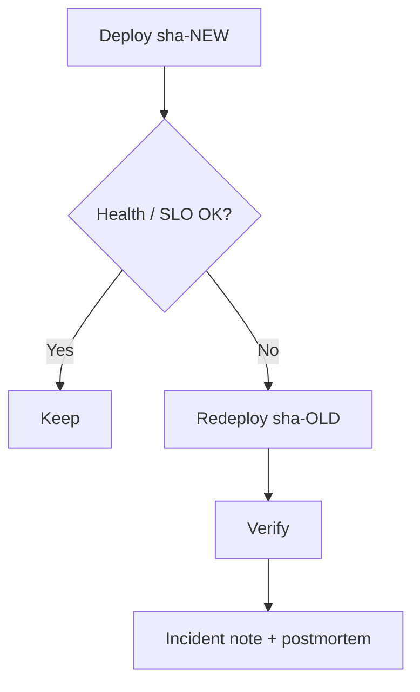

# DevOps & CI/CD

> **Language:** English · [Português (Brasil)](pt-br/DEVOPS_AND_CICD.md)

> How we ship Licitech: pipelines, artifacts, promotion, and rollback. Names and endpoints below are **generic examples**.

---

## 1. Design goals

| Goal | Measure |
|---|---|
| Fast feedback | PR checks finish within a minutes budget |
| Safe production changes | Promotion with health gate; one-command rollback path |
| Reproducible builds | Immutable images, content-addressed / tagged |
| Secure supply chain | Lint + SAST + dependency scan + image scan as merge blockers |
| Environment parity | The same image artifact promotes staging → production |



---

## 2. GitHub Actions

GitHub Actions is the sole CI/CD orchestrator (see [ADR-oriented notes in TECHNOLOGY_CHOICES](TECHNOLOGY_CHOICES.md)).

**Why**

- Lives next to the code; branch protections map directly to required checks
- Rich marketplace of security and quality actions
- Capable of OIDC for cloud auth without long-lived keys (roadmap)

**Constraints**

- Runner concurrency and minutes budget need monitoring
- Secrets scoped per environment; never echoed in logs

Example workflow (non-functional template): [`.github/workflows/deploy.example.yml`](../.github/workflows/deploy.example.yml)

---

## 3. CI pipeline

| Stage | Purpose | On failure |
|---|---|---|
| Checkout | Fetch the commit SHA | Abort |
| Dependency install | Locked install (`npm ci` / hashed `pip`) | Abort |
| Lint / typecheck | Style + static correctness | Abort |
| Unit tests | Fast suite | Abort |
| Integration tests (optional) | Contract checks against ephemeral deps | Abort |
| Security scan (SAST) | Patterns in code | Abort on high/critical per policy |
| Dependency scan | CVE gate | Abort on policy violation |



> [!IMPORTANT]
> CI must be **hermetic**: no dependency on production networks, production data, or mutable `latest` base images without digest pins.

---

## 4. Build pipeline

1. Resolve base image digests
2. Multi-stage Docker build (deps → build → runtime)
3. Tag with **git SHA** and optional **semver**
4. Generate SBOM (CycloneDX/SPDX) as a build artifact
5. Push to the registry only after the image scan passes

---

## 5. Docker build

**Principles**

- Non-root runtime user
- Minimal base (distroless / slim)
- No secrets in layers — BuildKit secret mounts if needed
- `.dockerignore` excludes local env, test caches, and unnecessary docs



---

## 6. Image versioning

| Tag | Meaning |
|---|---|
| `sha-<gitsha>` | Immutable build identity (preferred for deploy) |
| `semver-x.y.z` | Human release label (optional) |
| `staging` / `prod` | Moving pointers — never the sole deploy reference |

Deploy manifests reference **digest or sha tag**, not `latest`.

---

## 7. Health checks

| Probe | Question | Used by |
|---|---|---|
| Liveness | Process alive? | Orchestrator restart |
| Readiness | Safe to receive traffic? | LB / deploy gate |
| Startup | Boot finished? | Avoid premature kill |

Post-deploy: synthetic request against readiness + critical read path.

---

## 8. Rolling deployment



- Connection draining with graceful shutdown timeout
- Compatible with Dokploy/Docker restart semantics
- Database migrations follow **expand/contract** — never break old replicas mid-roll

---

## 9. Zero downtime

Checklist:

- [ ] Backward-compatible schema changes first
- [ ] Dual-write or feature flags when needed
- [ ] Readiness before shifting traffic
- [ ] No single-replica API deploys in production
- [ ] Frontend/API version skew tolerated within N releases

---

## 10. Rollback strategy

| Trigger | Action |
|---|---|
| Readiness failed after deploy | Redeploy previous `sha-*` image |
| Elevated error rate / SLO burn | Automatic or operator-initiated rollback |
| Bad migration | Forward-fix preferred; backup restore only if necessary |



> [!WARNING]
> Rollback of **destructive** migrations is not free. Prefer expand/contract and feature flags so image rollback is enough.

---

## 11. Artifact storage

| Artifact | Retention | Notes |
|---|---|---|
| Container images | N days / last M production SHAs | Addressable by digest |
| SBOM / scan reports | Aligned to compliance window | Attached to CI run |
| Build logs | Platform default + export for incidents | Redact secrets |

---

## 12. Environment promotion

```text
PR checks → merge → build → staging deploy → health → production promote
```

| Rule | Detail |
|---|---|
| Same artifact | Production runs the image validated in staging |
| Separated secrets | Staging credentials never reused in production |
| Manual approval | Optional gate for production (GitHub Environment) |
| Change record | Tie the deploy to commit SHA + CI run URL |

---

## 13. Infrastructure validation

Before accepting a deploy:

- Compose / deploy config lint
- Required env keys present (names only — values come from the secret store)
- TLS certificates valid beyond the threshold
- Disk space / inodes on the host
- Queue and DB connectivity in the readiness probe

---

## Related documents

- [ARCHITECTURE.md](ARCHITECTURE.md)
- [SECURITY_AND_COMPLIANCE.md](SECURITY_AND_COMPLIANCE.md)
- [OBSERVABILITY.md](OBSERVABILITY.md)
- [ROADMAP.md](../ROADMAP.md)
- [deploy.example.yml](../.github/workflows/deploy.example.yml)
