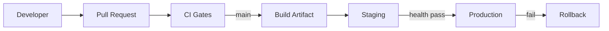
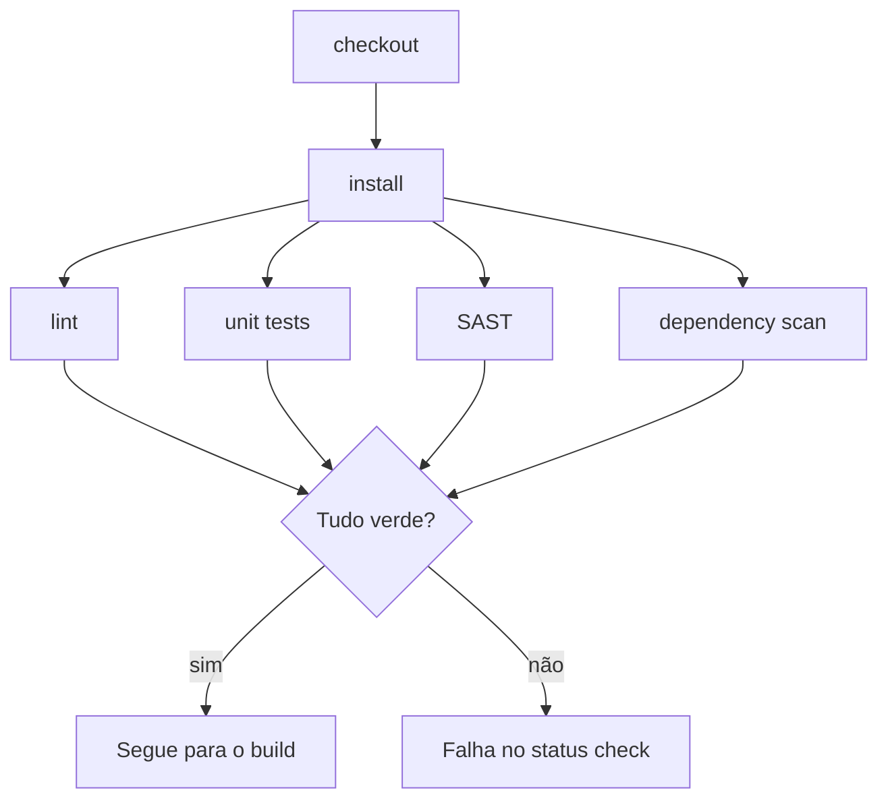
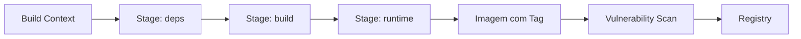
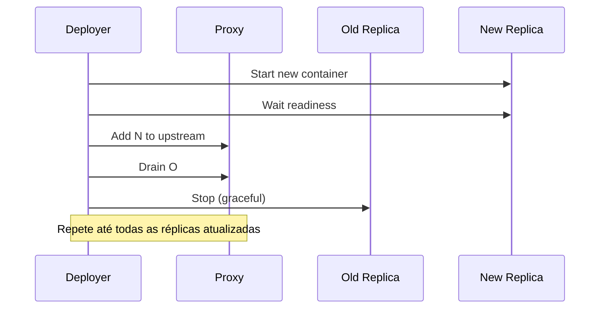
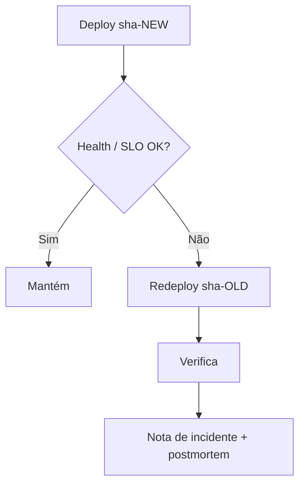

# DevOps & CI/CD

> Como a gente entrega a Licitera: pipelines, artefatos, promoção e rollback. Nomes e endpoints abaixo são **exemplos genéricos**.

---

## 1. Objetivos de design

| Objetivo | Medida |
|---|---|
| Feedback rápido | Checks de PR terminam dentro de um orçamento de minutos |
| Mudanças seguras em produção | Promoção com health gate; caminho de rollback em um comando |
| Builds reproduzíveis | Imagens imutáveis, content-addressed / com tag |
| Supply chain segura | Lint + SAST + scan de dependência + scan de imagem como blockers de merge |
| Paridade de ambientes | O mesmo artefato de imagem sobe de staging → production |



---

## 2. GitHub Actions

O GitHub Actions é o único orquestrador de CI/CD (veja [notas orientadas a ADR em TECHNOLOGY_CHOICES](TECHNOLOGY_CHOICES.md)).

**Por quê**

- Fica junto do código; branch protections mapeiam direto para required checks
- Marketplace rico de actions de segurança e qualidade
- Capaz de OIDC para auth em cloud sem chaves de longa duração (roadmap)

**Restrições**

- Concorrência de runners e orçamento de minutos precisam de monitoramento
- Secrets escopados por ambiente; nunca ecoados em logs

Exemplo de workflow (template não funcional): [`.github/workflows/deploy.example.yml`](../.github/workflows/deploy.example.yml)

---

## 3. Pipeline de CI

| Estágio | Propósito | Em caso de falha |
|---|---|---|
| Checkout | Busca o commit SHA | Aborta |
| Install de dependências | Install travado (`npm ci` / `pip` em modo hash) | Aborta |
| Lint / typecheck | Estilo + correção estática | Aborta |
| Unit tests | Suite rápida | Aborta |
| Integration tests (opcional) | Checks de contrato contra deps efêmeras | Aborta |
| Security scan (SAST) | Padrões no código | Aborta em high/critical pela política |
| Dependency scan | Gate de CVE | Aborta em violação de política |



> [!IMPORTANT]
> O CI precisa ser **hermético**: sem depender de redes de produção, dados de produção ou imagens base mutáveis `latest` sem pin de digest.

---

## 4. Pipeline de build

1. Resolver digests das imagens base
2. Docker build multi-stage (deps → build → runtime)
3. Tag com **git SHA** e **semver** opcional
4. Gerar SBOM (CycloneDX/SPDX) como artefato do build
5. Push para o registry só depois do scan da imagem passar

---

## 5. Docker build

**Princípios**

- Usuário runtime não-root
- Base mínima (distroless / slim)
- Sem secrets nas layers — BuildKit secret mounts se precisar
- `.dockerignore` exclui env local, caches de teste e docs desnecessários



---

## 6. Versionamento de imagens

| Tag | Significado |
|---|---|
| `sha-<gitsha>` | Identidade imutável do build (preferida para deploy) |
| `semver-x.y.z` | Label humana de release (opcional) |
| `staging` / `prod` | Ponteiros móveis — nunca a única referência de deploy |

Manifests de deploy referenciam **digest ou tag sha**, não `latest`.

---

## 7. Health checks

| Probe | Pergunta | Usado por |
|---|---|---|
| Liveness | Processo vivo? | Restart do orquestrador |
| Readiness | Seguro receber tráfego? | LB / gate de deploy |
| Startup | Boot terminou? | Evitar kill prematuro |

Pós-deploy: request sintético contra readiness + caminho crítico de leitura.

---

## 8. Rolling deployment



- Connection draining com timeout de graceful shutdown
- Compatível com a semântica de restart do Dokploy/Docker
- Migrations de banco seguem **expand/contract** — nunca quebrar réplicas antigas no meio do roll

---

## 9. Zero downtime

Checklist:

- [ ] Mudanças de schema backward-compatible primeiro
- [ ] Dual-write ou feature flags quando precisar
- [ ] Readiness antes de deslocar tráfego
- [ ] Sem deploys de API em single-replica em produção
- [ ] Skew de versão frontend/API tolerado dentro de N releases

---

## 10. Estratégia de rollback

| Gatilho | Ação |
|---|---|
| Readiness falhou depois do deploy | Redeploy da imagem `sha-*` anterior |
| Taxa de erro / burn de SLO elevados | Rollback automático ou iniciado pelo operador |
| Migration ruim | Forward-fix preferido; restore de backup só se necessário |



> [!WARNING]
> Rollback de migrations **destrutivas** não é de graça. Prefira expand/contract e feature flags para que o rollback de imagem seja suficiente.

---

## 11. Armazenamento de artefatos

| Artefato | Retenção | Notas |
|---|---|---|
| Imagens de container | N dias / últimos M SHAs de produção | Endereçáveis por digest |
| SBOM / relatórios de scan | Alinhado à janela de compliance | Anexados à run de CI |
| Logs de build | Default da plataforma + export para incidentes | Redigir secrets |

---

## 12. Promoção entre ambientes

```text
PR checks → merge → build → staging deploy → health → production promote
```

| Regra | Detalhe |
|---|---|
| Mesmo artefato | Produção roda a imagem validada em staging |
| Secrets separados | Credenciais de staging nunca reutilizadas em produção |
| Aprovação manual | Gate opcional para produção (GitHub Environment) |
| Registro de mudança | Ligar o deploy ao commit SHA + URL da run de CI |

---

## 13. Validação de infraestrutura

Antes de aceitar um deploy:

- Lint de Compose / config de deploy
- Chaves de env obrigatórias presentes (só nomes — valores vêm do secret store)
- Certificados TLS válidos além do limiar
- Espaço em disco / inodes no host
- Conectividade de queue e DB no probe de readiness

---

## Documentos relacionados

- [ARCHITECTURE.md](ARCHITECTURE.md)
- [SECURITY_AND_COMPLIANCE.md](SECURITY_AND_COMPLIANCE.md)
- [OBSERVABILITY.md](OBSERVABILITY.md)
- [ROADMAP.md](../ROADMAP.md)
- [deploy.example.yml](../.github/workflows/deploy.example.yml)
