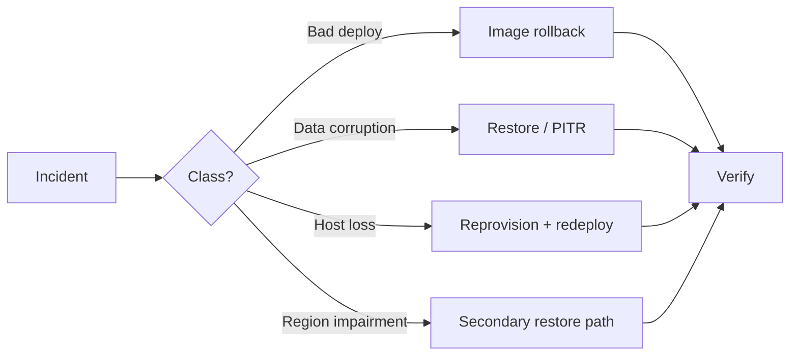
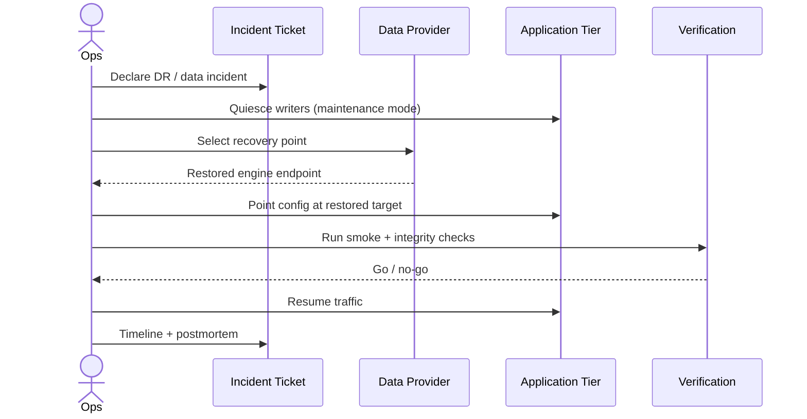

# Disaster Recovery

> Como a Licitera sobrevive a perda de dados, problema regional e release ruim — com alvos explícitos de RPO/RTO.

---

## 1. Objetivos

| Métrica | Alvo (design atual) | Significado |
|---|---|---|
| **RPO** | ≤ 24 horas (stretch ≤ 1 hora com PITR) | Máxima perda de dados aceitável |
| **RTO** | ≤ 8 horas (stretch ≤ 4 horas) | Máximo downtime aceitável |

> [!IMPORTANT]
> Os alvos são compromissos de arquitetura. Números reais dependem de SLAs do provedor, configuração de backup e frequência de ensaio dos runbooks.

---

## 2. Estratégia de backup

| Ativo | Método | Frequência | Retenção |
|---|---|---|---|
| PostgreSQL | Backups automáticos gerenciados + PITR | WAL contínuo / snapshots diários | Por política do provedor (ex.: 7–30 dias) |
| Object storage | Versioning / cross-backup | Contínuo | Baseado em política |
| Secrets | Backup out-of-band em store seguro | Na mudança | Acesso com dual-control |
| Imagens de container | Retenção no registry de SHAs known-good | A cada release | Últimos N SHAs de produção |
| Config de infra | Templates versionados / IaC (roadmap) | Na mudança | Histórico do Git |

**Regras**

- Backups são encrypted at rest
- Acesso à capacidade de restore é break-glass / dual control
- Backups de produção nunca são restaurados em ambientes compartilhados de desenvolvimento sem anonimização

---

## 3. Processo de restore

**Checklist (resumido)**

1. Congelar writes / ativar banner de manutenção
2. Identificar o último timestamp known-good
3. Restaurar primeiro em instância isolada quando a causa da corrupção não estiver clara
4. Validar contagens de rows / checksums / smoke tests da app
5. Repontar a aplicação; revogar o endpoint antigo
6. Monitorar error budgets de perto por 24h

---

## 4. Snapshots

- Prefira snapshots nativos do provedor para Postgres e discos
- Snapshot antes de migrations de alto risco
- Tag snapshots com IDs de tickets de mudança
- Teste restore trimestralmente (mínimo)

---

## 5. Rollback

| Camada | Mecanismo |
|---|---|
| Imagem da aplicação | Redeploy do `sha-*` anterior |
| Frontend | Rollback instantâneo da Vercel para o deploy anterior |
| Feature flags | Desligar o caminho ofensor |
| Schema | Forward-fix; evitar reverse migrations a menos que ensaiadas |

Veja [DEVOPS_AND_CICD.md](DEVOPS_AND_CICD.md).

---

## 6. Continuidade de negócio

| Capacidade | Modo de continuidade |
|---|---|
| Browse read-only dos últimos dados bons | Possível se o DB for restaurado read-only |
| Ingestão | Pausar; backlog da queue drena após a recovery |
| Notificações | Pausar para evitar tempestade de duplicatas; replay com cuidado |
| Auth | Depende do status regional do IdP — comunicar via status page |

Plano de comunicação: updates de status para tenants nos canais combinados; sem ETAs especulativos.

---

## 7. Cenários de disaster recovery

| Cenário | Resposta primária |
|---|---|
| Falha de um container | Restart do orquestrador |
| Falha de host | Redeploy de imagens no host de reposição; restaurar volumes se precisar |
| Delete em massa acidental | PITR para o timestamp pré-incidente |
| Ransomware / destruição hostil | Isolar; restore de backups offline/imutáveis |
| Release ruim | Rollback de imagem + flag off |
| Outage regional do provedor | Esperar + comunicar; restore em região secundária (longo prazo) |

---

## 8. RPO & RTO — exemplo trabalhado

```mermaid
gantt
    title Timeline Ilustrativa de Recovery (Perda de Host)
    dateFormat HH:mm
    axisFormat %H:%M
    section Detection
    Alert & triage           :a1, 00:00, 30m
    section Recovery
    Provision host           :a2, after a1, 60m
    Deploy known-good images :a3, after a2, 30m
    Verify health            :a4, after a3, 30m
    section Data
    Confirm DB reachable     :a5, after a1, 45m
```

Se o banco gerenciado continuar saudável enquanto o compute se perde, o RTO colapsa para **reprovision + deploy + verify**. Se o próprio banco precisar de restore, RPO/RTO acompanham a frescor do backup e a duração do restore.

---

## 9. Drills

| Drill | Cadência |
|---|---|
| Rollback de imagem | A cada major release train |
| Restore de backup em staging | Trimestral |
| Rotação de secret | Semestral |
| Tabletop de outage regional | Anual |

---

## Documentos relacionados

- [DEVOPS_AND_CICD.md](DEVOPS_AND_CICD.md)
- [OBSERVABILITY.md](OBSERVABILITY.md)
- [SECURITY_AND_COMPLIANCE.md](SECURITY_AND_COMPLIANCE.md)
- [ROADMAP.md](../ROADMAP.md)
