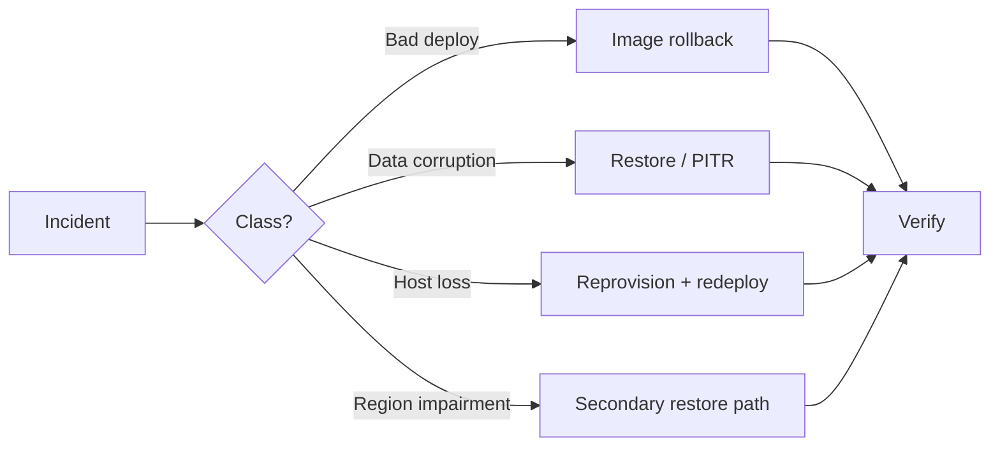
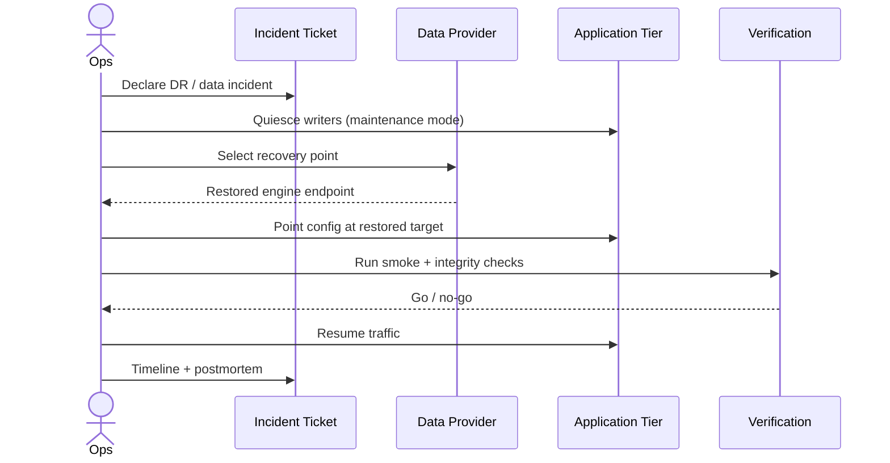

# Disaster Recovery

> How Licitech survives data loss, regional impairment, and a bad release — with explicit RPO/RTO targets.

---

## 1. Objectives

| Metric | Target (current design) | Meaning |
|---|---|---|
| **RPO** | ≤ 24 hours (stretch ≤ 1 hour with PITR) | Maximum acceptable data loss |
| **RTO** | ≤ 8 hours (stretch ≤ 4 hours) | Maximum acceptable downtime |

> [!IMPORTANT]
> Targets are architecture commitments. Real numbers depend on provider SLAs, backup configuration, and how often runbooks are rehearsed.

---

## 2. Backup strategy

| Asset | Method | Frequency | Retention |
|---|---|---|---|
| PostgreSQL | Managed automatic backups + PITR | Continuous WAL / daily snapshots | Per provider policy (e.g. 7–30 days) |
| Object storage | Versioning / cross-backup | Continuous | Policy-based |
| Secrets | Out-of-band backup in a secure store | On change | Dual-control access |
| Container images | Registry retention of known-good SHAs | Every release | Last N production SHAs |
| Infra config | Versioned templates / IaC (roadmap) | On change | Git history |

**Rules**

- Backups are encrypted at rest
- Access to restore capability is break-glass / dual control
- Production backups are never restored into shared development environments without anonymization

---

## 3. Restore process

**Checklist (summary)**

1. Freeze writes / enable maintenance banner
2. Identify the last known-good timestamp
3. Restore first on an isolated instance when the corruption cause is unclear
4. Validate row counts / checksums / app smoke tests
5. Repoint the application; revoke the old endpoint
6. Monitor error budgets closely for 24h

---

## 4. Snapshots

- Prefer provider-native snapshots for Postgres and disks
- Snapshot before high-risk migrations
- Tag snapshots with change-ticket IDs
- Test restore quarterly (minimum)

---

## 5. Rollback

| Layer | Mechanism |
|---|---|
| Application image | Redeploy previous `sha-*` |
| Frontend | Instant Vercel rollback to previous deploy |
| Feature flags | Turn off the offending path |
| Schema | Forward-fix; avoid reverse migrations unless rehearsed |

See [DEVOPS_AND_CICD.md](DEVOPS_AND_CICD.md).

---

## 6. Business continuity

| Capability | Continuity mode |
|---|---|
| Read-only browse of last good data | Possible if DB is restored read-only |
| Ingestion | Pause; queue backlog drains after recovery |
| Notifications | Pause to avoid duplicate storms; replay carefully |
| Auth | Depends on IdP regional status — communicate via status page |

Communication plan: status updates to tenants on agreed channels; no speculative ETAs.

---

## 7. Disaster recovery scenarios

| Scenario | Primary response |
|---|---|
| Single container failure | Orchestrator restart |
| Host failure | Redeploy images on replacement host; restore volumes if needed |
| Accidental mass delete | PITR to pre-incident timestamp |
| Ransomware / hostile destruction | Isolate; restore from offline/immutable backups |
| Bad release | Image rollback + flag off |
| Provider regional outage | Wait + communicate; restore in secondary region (long term) |

---

## 8. RPO & RTO — worked example

```mermaid
gantt
    title Illustrative Recovery Timeline (Host Loss)
    dateFormat HH:mm
    axisFormat %H:%M
    section Detection
    Alert & triage           :a1, 00:00, 30m
    section Recovery
    Provision host           :a2, after a1, 60m
    Deploy known-good images :a3, after a2, 30m
    Verify health            :a4, after a3, 30m
    section Data
    Confirm DB reachable     :a5, after a1, 45m
```

If the managed database stays healthy while compute is lost, RTO collapses to **reprovision + deploy + verify**. If the database itself needs restore, RPO/RTO track backup freshness and restore duration.

---

## 9. Drills

| Drill | Cadence |
|---|---|
| Image rollback | Every major release train |
| Backup restore in staging | Quarterly |
| Secret rotation | Semiannual |
| Regional-outage tabletop | Annual |

---

## Related documents

- [DEVOPS_AND_CICD.md](DEVOPS_AND_CICD.md)
- [OBSERVABILITY.md](OBSERVABILITY.md)
- [SECURITY_AND_COMPLIANCE.md](SECURITY_AND_COMPLIANCE.md)
- [ROADMAP.md](../ROADMAP.md)
