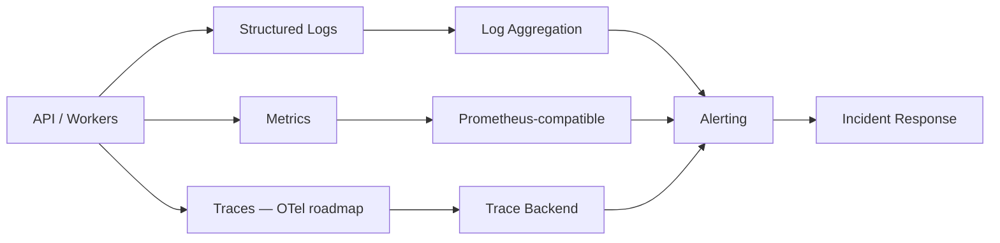
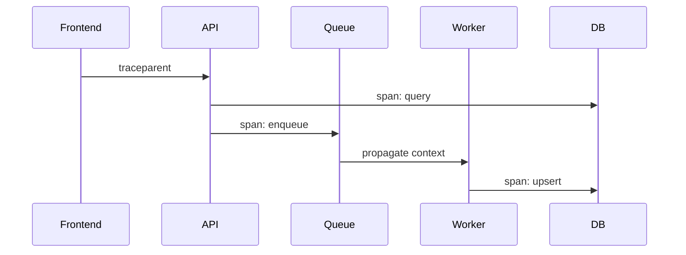
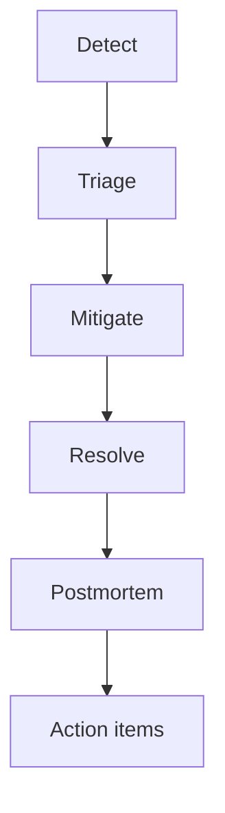

# Observability

> **Language:** English · [Português (Brasil)](pt-br/OBSERVABILITY.md)

> Make the system diagnosable when something breaks — without attaching a debugger to a production host.

---

## 1. Monitoring strategy

Licitech follows the classic three pillars, with correlation IDs stitching them together:

| Pillar | Primary questions |
|---|---|
| **Logs** | What exactly happened on request/job X? |
| **Metrics** | Is the system healthy *right now*? Are SLOs burning? |
| **Traces** | Where did latency accumulate across API → queue → worker → DB? |

> [!TIP]
> Prefer **symptoms** (user-visible latency, error rate, queue lag) over low-level host metrics as primary pages. Host metrics remain diagnostic context.

---

## 2. Logging

**Standards**

- Structured JSON logs
- Fields: `timestamp`, `level`, `service`, `env`, `correlation_id`, `tenant_id` (when safe), `message`
- **Never** log secrets, tokens, passwords, raw auth headers, or full PII payloads
- Bounded log volume — sample or aggregate high-cardinality paths if needed

| Level | Use |
|---|---|
| `DEBUG` | Local / staging only |
| `INFO` | Lifecycle, successful job completion |
| `WARN` | Retryable degradation |
| `ERROR` | Request/job failed after handling |
| `FATAL` | Process cannot continue |

---

## 3. Metrics

| Category | Examples |
|---|---|
| RED (API) | Request rate, error rate, duration (p50/p95/p99) |
| Workers | Jobs processed, fail rate, retry count, lag |
| Dependencies | DB pool wait, Redis latency, upstream 429s |
| Saturation | CPU, memory, disk, connection-pool usage |
| Business (carefully) | Records ingested/min (aggregated, non-sensitive) |

Example scrape config: [`prometheus.example.yml`](../config-templates/prometheus.example.yml)

---

## 4. Tracing

**Today:** correlation IDs propagated in API logs and worker job metadata.

**Target (OpenTelemetry):**

Adoption plan: auto-instrument HTTP + DB clients first; custom spans on critical domain sections later. See [ROADMAP.md](../ROADMAP.md).

---

## 5. Alerting

| Severity | Example | Response |
|---|---|---|
| **P1** | API availability below SLO | Page on-call |
| **P2** | Elevated p95 / error-budget burn | Same-day triage |
| **P3** | Queue lag above soft threshold | Ticket / next business hours |
| **P4** | Disk growth trend | Planned capacity work |

Alert design rules:

- Alert on **burn rate** / symptoms, not an isolated blip
- Every alert links to a runbook
- No orphan alerts — owners required

---

## 6. Health checks

| Endpoint | Semantics |
|---|---|
| `/health/live` | Process up |
| `/health/ready` | Dependencies reachable (DB, queue) |

Orchestrators restart on liveness failure; load balancers remove on readiness failure.

---

## 7. Incident response

| Phase | Actions |
|---|---|
| Detect | Alert / user report |
| Triage | Severity, blast radius, correlation-ID hunt |
| Mitigate | Rollback, scale out, feature-flag off, rate-limit |
| Resolve | Confirm SLOs are recovering |
| Postmortem | Blameless; timeline; contributing factors; fixes |

Security incidents also follow the breach-notification path under LGPD considerations ([SECURITY_AND_COMPLIANCE.md](SECURITY_AND_COMPLIANCE.md)).

---

## 8. Future OpenTelemetry adoption

| Step | Outcome |
|---|---|
| 1. Choose OTLP backend | Vendor-neutral export |
| 2. Instrument the API | HTTP + DB spans |
| 3. Propagate into jobs | Context in queue header / payload |
| 4. Unify with logs | `trace_id` field in JSON logs |
| 5. Trace-based alerts | Slow-dependency detection |

---

## Related documents

- [ARCHITECTURE.md](ARCHITECTURE.md)
- [DEVOPS_AND_CICD.md](DEVOPS_AND_CICD.md)
- [DISASTER_RECOVERY.md](DISASTER_RECOVERY.md)
