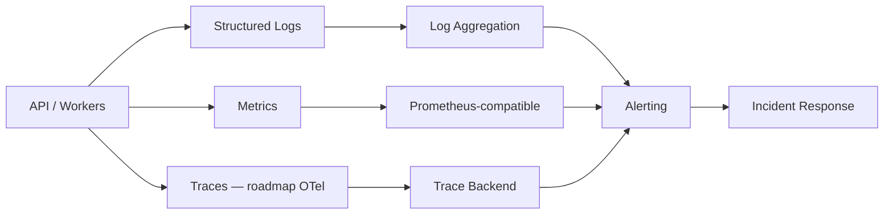
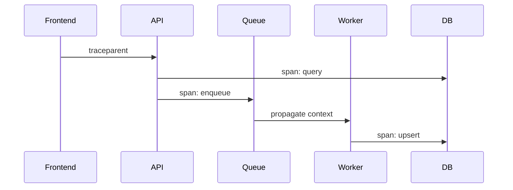
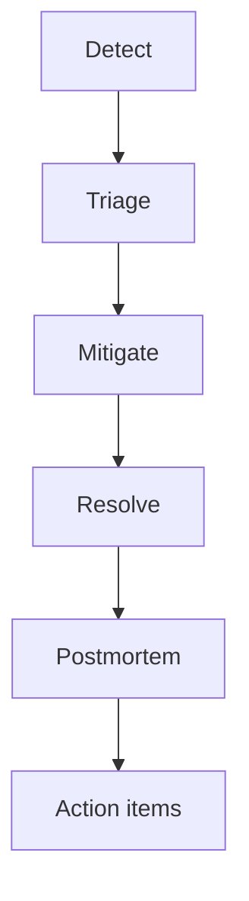

# Observabilidade

> Deixar o sistema diagnosticável quando algo quebra — sem precisar abrir debugger em host de produção.

---

## 1. Estratégia de monitoramento

A Licitera segue os três pilares clássicos, com correlation IDs costurando tudo:

| Pilar | Perguntas principais |
|---|---|
| **Logs** | O que exatamente aconteceu na request/job X? |
| **Metrics** | O sistema está saudável *agora*? Os SLOs estão queimando? |
| **Traces** | Onde a latência acumulou em API → queue → worker → DB? |

> [!TIP]
> Prefira **sintomas** (latência vista pelo usuário, taxa de erro, lag da queue) a métricas de host de baixo nível como páginas primárias. Métricas de host continuam como contexto de diagnóstico.

---

## 2. Logging

**Padrões**

- Logs estruturados em JSON
- Fields: `timestamp`, `level`, `service`, `env`, `correlation_id`, `tenant_id` (quando seguro), `message`
- **Nunca** logar secrets, tokens, passwords, auth headers crus ou payloads completos de PII
- Volume de log limitado — sample ou agregue caminhos de alta cardinalidade se precisar

| Level | Uso |
|---|---|
| `DEBUG` | Só local / staging |
| `INFO` | Ciclo de vida, conclusão bem-sucedida de job |
| `WARN` | Degradação retryable |
| `ERROR` | Request/job falhou após o handling |
| `FATAL` | Processo não consegue continuar |

---

## 3. Metrics

| Categoria | Exemplos |
|---|---|
| RED (API) | Request rate, error rate, duration (p50/p95/p99) |
| Workers | Jobs processados, fail rate, contagem de retry, lag |
| Dependencies | Espera do pool de DB, latência Redis, 429s upstream |
| Saturation | CPU, memória, disco, uso do connection pool |
| Business (com cuidado) | Registros ingeridos/min (agregado, não sensível) |

Exemplo de scrape config: [`prometheus.example.yml`](../config-templates/prometheus.example.yml)

---

## 4. Tracing

**Hoje:** correlation IDs propagados nos logs da API e nos metadados dos jobs dos workers.

**Alvo (OpenTelemetry):**

Plano de adoção: auto-instrumentar HTTP + clients de DB primeiro; spans customizados em seções críticas de domínio depois. Veja [ROADMAP.md](../ROADMAP.md).

---

## 5. Alerting

| Severidade | Exemplo | Resposta |
|---|---|---|
| **P1** | Disponibilidade da API abaixo do SLO | Page no on-call |
| **P2** | p95 elevado / burn de error budget | Triagem no mesmo dia |
| **P3** | Lag da queue acima do limiar soft | Ticket / próximo horário comercial |
| **P4** | Tendência de crescimento de disco | Trabalho planejado de capacidade |

Regras de design de alerta:

- Alertar por **burn rate** / sintomas, não por um blip isolado
- Todo alerta tem link para runbook
- Sem alertas órfãos — owners obrigatórios

---

## 6. Health checks

| Endpoint | Semântica |
|---|---|
| `/health/live` | Processo no ar |
| `/health/ready` | Dependencies alcançáveis (DB, queue) |

Orquestradores reiniciam em falha de liveness; load balancers removem em falha de readiness.

---

## 7. Resposta a incidentes

| Fase | Ações |
|---|---|
| Detect | Alerta / reporte de usuário |
| Triage | Severidade, raio de impacto, caça ao correlation ID |
| Mitigate | Rollback, scale out, desligar feature flag, rate-limit |
| Resolve | Confirmar que SLOs estão voltando |
| Postmortem | Sem culpa; timeline; fatores contribuintes; correções |

Incidentes de segurança também seguem o caminho de notificação de breach sob considerações de LGPD ([SECURITY_AND_COMPLIANCE.md](SECURITY_AND_COMPLIANCE.md)).

---

## 8. Adoção futura de OpenTelemetry

| Passo | Resultado |
|---|---|
| 1. Escolher backend OTLP | Export vendor-neutral |
| 2. Instrumentar a API | Spans de HTTP + DB |
| 3. Propagar para jobs | Contexto em header / payload da queue |
| 4. Unificar com logs | Field `trace_id` nos logs JSON |
| 5. Alertas baseados em trace | Detecção de dependency lenta |

---

## Documentos relacionados

- [ARCHITECTURE.md](ARCHITECTURE.md)
- [DEVOPS_AND_CICD.md](DEVOPS_AND_CICD.md)
- [DISASTER_RECOVERY.md](DISASTER_RECOVERY.md)
