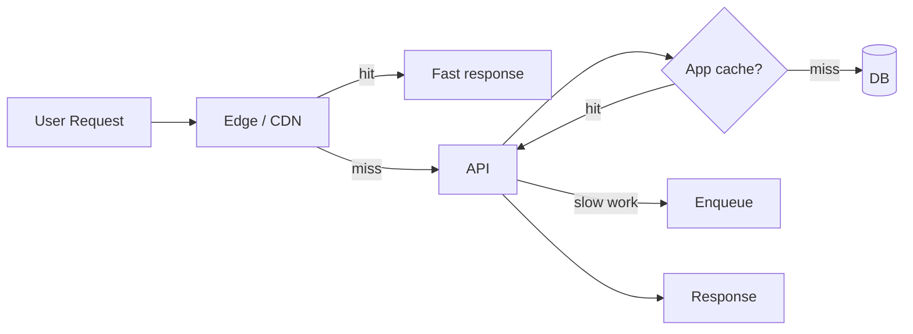
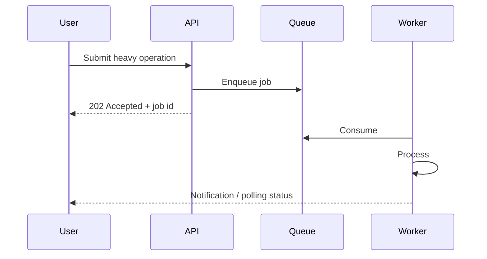

# Performance

> Keep the user path fast: slow work off the request and aggressive caching at the edge.

---

## 1. Performance optimization principles

1. **Measure before optimizing** — p95/p99 > averages
2. **Optimize the synchronous path** — everything else goes async
3. **Cache with correctness** — tenant isolation first
4. **Bound the work** — timeouts, payload limits, pagination
5. **Prefer sequential clarity over premature micro-optimizations**

---

## 2. Edge rendering

- Next.js on Vercel: static generation / SSR / edge middleware per route
- Personalization stays behind auth; public marketing pages maximized for static delivery
- Avoid blocking TTFB on non-critical downstream calls

---

## 3. CDN

| Asset type | Strategy |
|---|---|
| Content-hashed JS/CSS | Long cache, immutable |
| Images | CDN transforms / modern formats when available |
| API responses | Generally `Cache-Control: private` / short or no-store for authenticated data |

---

## 4. Caching

See also [SCALABILITY.md](SCALABILITY.md). Performance-specific notes:

- Stampede protection (single-flight) on hot keys
- Negative caching for known-misses with short TTL
- Prefer cache-aside for simplicity at the current scale

---

## 5. Compression

- Gzip/Brotli at the CDN and reverse proxy for text assets
- Avoid compressing already-compressed binaries
- JSON responses benefit meaningfully on mobile networks

---

## 6. Connection reuse

- Keep-alive to the upstream API from the edge
- HTTP connection pooling in server-side clients
- Persistent DB connections via pooler — not one connection per request without pooling

---

## 7. Background processing

| On the request path | Offloaded to workers |
|---|---|
| AuthZ + primary read/write | Bulk ingestion |
| Small notification fan-out (optional) | Large exports |
| Idempotent acknowledgements | Enrichment pipelines |

This split is the largest structural performance lever in the architecture.

---

## 8. Database optimization

| Practice | Intent |
|---|---|
| Indexed access paths for hot queries | Stable p95 |
| Pagination (`LIMIT`/`KEYSET`) | Bound response size |
| Avoid N+1 | Intentional batch / join |
| Analyze slow query logs | Continuous improvement |
| Separate analytical load | Protect OLTP (read replica later) |

---

## 9. Async processing

Clients get fast acknowledgements; users track progress via status endpoints or notifications.

---

## Performance budgets (illustrative)

| Surface | Budget (illustrative) |
|---|---|
| Marketing LCP | < 2.5s on mid-tier mobile |
| Authenticated list p95 | < 500 ms server-side |
| Enqueue ACK | < 100 ms |
| Worker job (median ingest) | Domain-dependent; tracked as an SLO |

> [!NOTE]
> The budgets above are **architectural targets**, not production measurements from this repository.

---

## Related documents

- [ARCHITECTURE.md](ARCHITECTURE.md)
- [SCALABILITY.md](SCALABILITY.md)
- [OBSERVABILITY.md](OBSERVABILITY.md)
