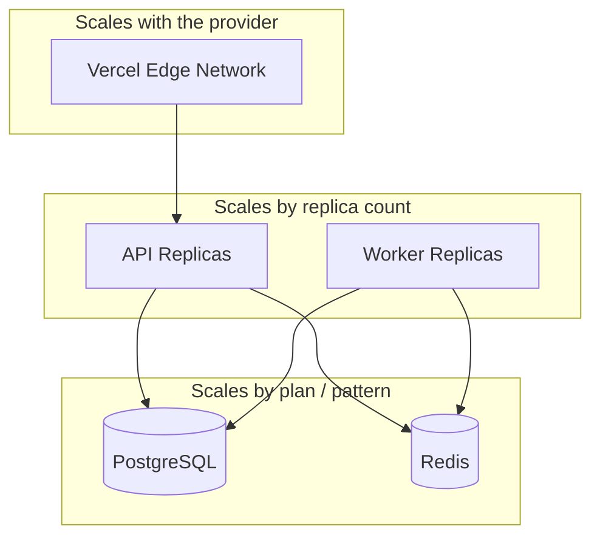
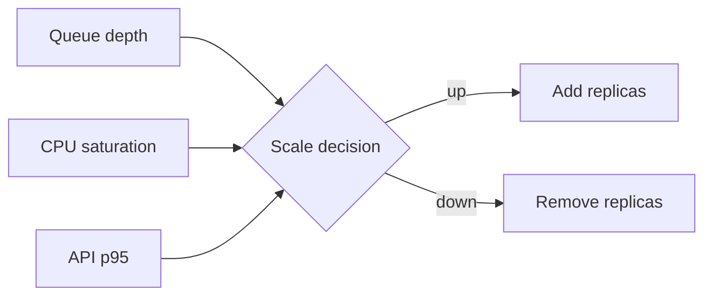
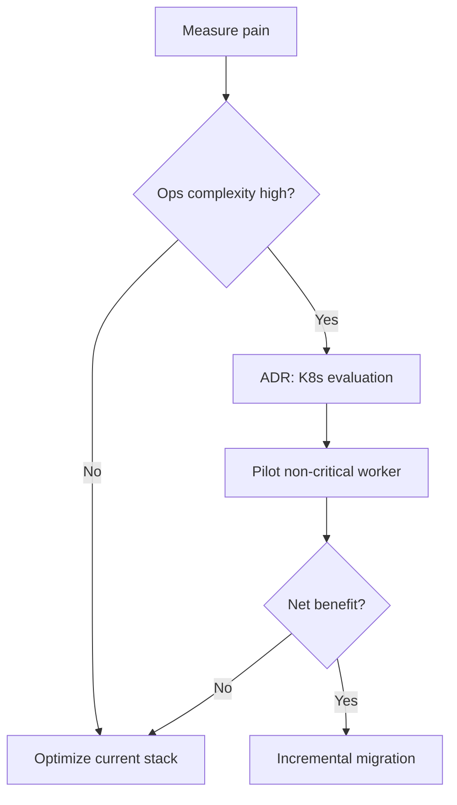

# Scalability

> Horizontal scale first. Kubernetes, mesh, and company only enter when operational metrics demand them.

---

## 1. Horizontal scale

| Layer | Scale unit | Constraint |
|---|---|---|
| Frontend | Edge regions / ISR / CDN | Platform limits |
| API | Container replicas | DB pool budget |
| Workers | Container replicas | Queue throughput / upstream rate limits |
| Postgres | Vertical + read replicas (later) | Connection & IOPS |
| Redis | Vertical / clustered (later) | Memory & persistence mode |

---

## 2. Stateless services

API and workers **do not hold durable local state**. Scale-out does not require session affinity.

Implications:

- Any replica serves any request
- Rolling deploys stay simple
- Crash recovery = restart + reconsume

---

## 3. Worker pools

| Pool | Work type | Scale signal |
|---|---|---|
| Ingestion | Fetch & normalize | Queue depth / source windows |
| Enrichment | CPU / IO enrichment | Job age |
| Notification | Message fan-out | Queue depth |

Pools can be separate deploys sharing the same image with different command/env — isolates noisy workloads.

---

## 4. Autoscaling

**Today:** manual / scheduled replica adjustments via the orchestration UI.

**Target signals:**

Guards: cooldown periods, max replica caps (cost + DB pool), min replicas for HA.

---

## 5. Cache strategy

| Layer | What | TTL / invalidation |
|---|---|---|
| CDN / Edge | Static assets, cacheable pages | Platform + cache headers |
| Application | Hot read models | Short TTL + explicit bust on write |
| Redis | Rate limits, ephemeral computations | Key TTL |
| Database | Materialized views (selective) | Refresh jobs |

> [!WARNING]
> Cache only **tenant-safe** payloads. Never serve cross-tenant cached responses.

---

## 6. Connection pooling

- Cap the app-side pool so `replicas × pool ≤ DB max_connections` (with headroom)
- Prefer a pooler (e.g. managed pooler / PgBouncer-style) for many short queries
- Workers use pool budgets separate from the API

---

## 7. Queue processing at scale

- Partition work by entity key when order matters
- Batch when safe to reduce DB round-trips
- Apply source politeness limits independent of consumer concurrency
- Dead-letter monitoring prevents backlog rotting in silence

---

## 8. Database bottlenecks

| Symptom | Typical cause | Mitigation |
|---|---|---|
| Rising query p95 | Missing indexes / seq scans | Explain plans; index; rewrite |
| Pool wait | Too many replicas / large pools | Pooler; shrink pool; scale reads |
| Lock contention | Hot-row updates | Shard keys; serialize via queue |
| Storage growth | Unbounded history | Retention jobs; cold storage |

---

## 9. Future migration to Kubernetes

Kubernetes is a **possible** destination — not the default.

| Stay on Docker + Dokploy when… | Consider K8s when… |
|---|---|
| Replica count stays modest | Many services need declarative HPA |
| Single-region compute is enough | Multi-region scheduling is required |
| Ops team is small | Need standardized mesh / policy engines |
| Deploy pain is low | Deploy topology outgrows Compose comfort |

Exit criteria and trade-offs: [ADR 0001](ADR/0001-docker-over-kubernetes.md).

---

## Related documents

- [ARCHITECTURE.md](ARCHITECTURE.md)
- [PERFORMANCE.md](PERFORMANCE.md)
- [ROADMAP.md](../ROADMAP.md)
