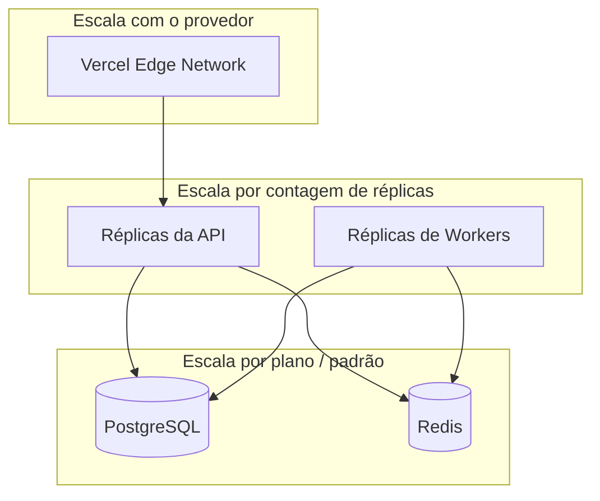
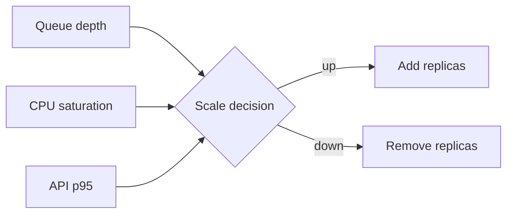
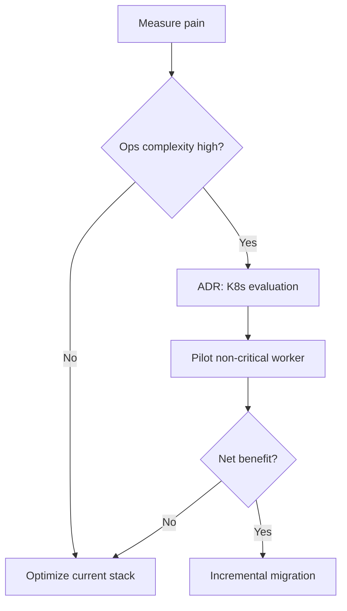

# Escalabilidade

> Escala horizontal primeiro. Kubernetes, mesh e companhia só entram quando as métricas operacionais pedirem.

---

## 1. Escala horizontal

| Camada | Unidade de escala | Constraint |
|---|---|---|
| Frontend | Regiões de edge / ISR / CDN | Limites da plataforma |
| API | Réplicas de container | Orçamento do pool de DB |
| Workers | Réplicas de container | Throughput da queue / rate limits upstream |
| Postgres | Vertical + read replicas (depois) | Connection & IOPS |
| Redis | Vertical / clustered (depois) | Memória & modo de persistência |

---

## 2. Serviços stateless

API e workers **não guardam estado local durável**. Scale out não exige session affinity.

Implicações:

- Qualquer réplica atende qualquer request
- Rolling deploys ficam simples
- Recovery de crash = restart + reconsume

---

## 3. Pools de workers

| Pool | Tipo de trabalho | Sinal de escala |
|---|---|---|
| Ingestão | Fetch & normalize | Profundidade da queue / janelas de fonte |
| Enrichment | Enrichment CPU / IO | Idade do job |
| Notification | Fan-out de mensagens | Profundidade da queue |

Pools podem ser deploys separados compartilhando a mesma imagem com command/env diferentes — isola workloads barulhentos.

---

## 4. Autoscaling

**Hoje:** ajustes manuais / agendados de réplicas via UI de orquestração.

**Sinais-alvo:**

Guards: períodos de cooldown, caps máximos de réplica (custo + pool de DB), mínimas de réplica para HA.

---

## 5. Estratégia de cache

| Camada | O quê | TTL / invalidação |
|---|---|---|
| CDN / Edge | Assets estáticos, páginas cacheáveis | Plataforma + cache headers |
| Application | Read models quentes | TTL curto + bust explícito no write |
| Redis | Rate limits, computações efêmeras | TTL da key |
| Database | Materialized views (seletivo) | Jobs de refresh |

> [!WARNING]
> Cacheie só payloads **seguros por tenant**. Nunca sirva respostas em cache cross-tenant.

---

## 6. Connection pooling

- Limite o pool no lado da app para que `replicas × pool ≤ DB max_connections` (com folga)
- Prefira um pooler (ex.: pooler gerenciado / estilo PgBouncer) para muitas queries curtas
- Workers usam orçamentos de pool separados da API

---

## 7. Processamento de queue em escala

- Particione o trabalho por chave de entidade quando a ordem importa
- Faça batch quando for seguro para reduzir round-trips ao DB
- Aplique limites de educação da fonte independentes da concorrência do consumer
- Monitoramento de dead-letter evita backlog apodrecendo em silêncio

---

## 8. Gargalos de database

| Sintoma | Causa típica | Mitigação |
|---|---|---|
| p95 de query subindo | Indexes faltando / seq scans | Explain plans; index; reescrever |
| Espera no pool | Réplicas demais / pools grandes | Pooler; reduzir pool; scale de reads |
| Lock contention | Updates em hot rows | Shard keys; serialização via queue |
| Crescimento de storage | Histórico sem limite | Jobs de retenção; cold storage |

---

## 9. Migração futura para Kubernetes

Kubernetes é um destino **possível** — não o default.

| Fique em Docker + Dokploy quando… | Considere K8s quando… |
|---|---|
| Contagem de réplicas continua modesta | Muitos serviços precisam de HPA declarativo |
| Compute single-region basta | Scheduling multi-região é necessário |
| Time de ops pequeno | Precisa de mesh / policy engines padronizados |
| Dor de deploy é baixa | Topologia de deploy passa do conforto do Compose |

Critérios de saída e trade-offs: [ADR 0001](ADR/0001-docker-over-kubernetes.md).

---

## Documentos relacionados

- [ARCHITECTURE.md](ARCHITECTURE.md)
- [PERFORMANCE.md](PERFORMANCE.md)
- [ROADMAP.md](../ROADMAP.md)
