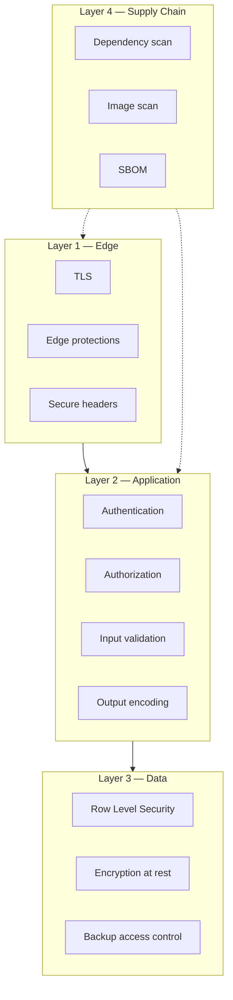
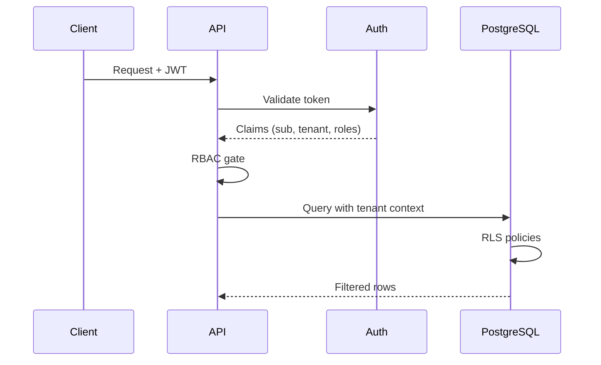
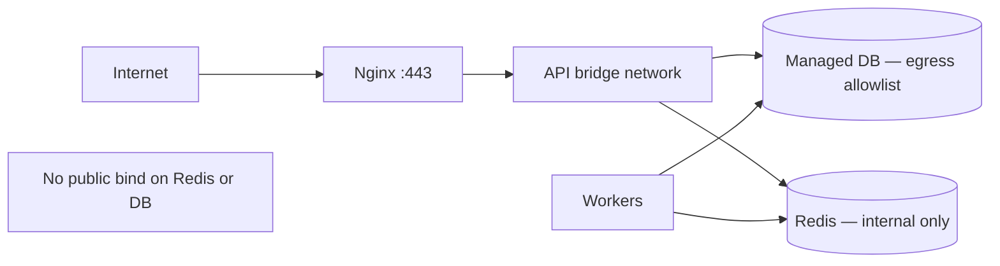

# Security & Compliance

> **Language:** English · [Português (Brasil)](pt-br/SECURITY_AND_COMPLIANCE.md)

> Public security documentation for the architecture. No real secrets, certificates, or production identifiers.

---

## 1. Security posture overview

Licitech operates with **defense in depth** and **zero-trust** assumptions between layers. Every hop authenticates and authorizes — being on the network is never enough.

---

## 2. Secrets management

| Practice | Detail |
|---|---|
| No secrets in git | Enforced by `.gitignore` + secret scanning |
| Runtime injection | Environment / secret store at process start |
| Rotation | Documented rotation of signing keys and DB credentials |
| Minimal exposure | Workers receive only the secrets they need |
| Audit | Access to production secrets is logged |

> [!CAUTION]
> Example files (`env.example`) contain **placeholders only**. Never copy production values into this repository.

**Roadmap:** Centralized Secrets Manager with short-lived credentials (see [ROADMAP.md](../ROADMAP.md)).

---

## 3. Environment variables

- Separated by environment (`development`, `staging`, `production`)
- Typed validation at boot — the process refuses to start if a required key is missing
- Distinction between **public** config (feature flags) and **secret** config (credentials)

---

## 4. JWT

| Topic | Approach |
|---|---|
| Issuance | Identity provider (Supabase Auth) |
| Validation | Signature, `exp`, `aud` / issuer checks at the API |
| Storage (browser) | Secure HttpOnly cookies preferred over `localStorage` when viable |
| Rotation | Signing-key rotation supported by the provider |
| Revocation | Short TTL + refresh; server-side session invalidation when needed |

---

## 5. Authentication

- Centralized IdP — the application does not store password hashes when auth is provider-managed
- MFA available at the IdP layer for privileged tenants (policy-dependent)
- Session-fixation and CSRF mitigations on cookie-based flows

---

## 6. Authorization

| Model | Use |
|---|---|
| Role-based (RBAC) | Coarse permissions (admin, member, viewer) |
| Tenant isolation | Mandatory tenant claim on every request |
| Resource checks | Object-level checks in the domain layer |
| Defense in depth | RLS enforces tenancy even if the app has a bug |

---

## 7. Row Level Security (RLS)

- Enabled on tenant-owned tables
- Policies bound to JWT claims / DB session variables
- Service role reserved for trusted workers, with audited use
- Application code never “turns off RLS” on user-facing paths

---

## 8. Container isolation

- Non-root user
- Read-only root filesystem when practical
- Dropped Linux capabilities
- No Docker socket mounted into app containers
- Resource limits (CPU / memory) to contain noisy neighbors

---

## 9. Network isolation

- Redis and internal admin ports are **not** published to the internet
- Worker egress controlled for source fetching
- Frontend talks only to the public API hostname over TLS

---

## 10. Least privilege

| Actor | Privilege |
|---|---|
| Anonymous user | Public marketing routes only |
| Authenticated user | Own-tenant data |
| Tenant admin | Tenant user management |
| Worker service role | Narrow tables / operations required by jobs |
| CI deploy role | Image push + deploy — no DB admin |

---

## 11. OWASP Top 10 — mapping

| Risk | Mitigation |
|---|---|
| Broken Access Control | RBAC + RLS + tests |
| Cryptographic Failures | TLS everywhere; managed secrets; no home-grown crypto |
| Injection | Parameterized queries; strict validation |
| Insecure Design | Threat model + ADRs |
| Security Misconfiguration | Hardened images; secure headers; CIS-oriented baselines |
| Vulnerable Components | Dependency + image scan in CI |
| Auth Failures | IdP best practices; MFA for privileged ops |
| Software & Data Integrity | Locked/signed deps; immutable artifacts |
| Logging Failures | Security-relevant structured logs (no secrets) |
| SSRF | Egress allowlists; block link-local / metadata IPs |

---

## 12. Dependency scanning

- Lockfiles committed
- CI fails at the severity threshold
- Dependabot / Renovate-style updates (process-dependent)
- Review licenses for compliance

---

## 13. Image scanning

- Scan every image before promotion
- Base-image updates on a cadence
- No `latest` in production deploys

---

## 14. Supply chain security

| Control | Status |
|---|---|
| Locked dependencies | Required |
| CI on trusted runners | Required |
| Minimal build context | Required |
| SBOM generation | Pipeline artifact |
| Provenance / attestations | Roadmap |

---

## 15. SBOM

- Generated per build (CycloneDX or SPDX)
- Retained with the release artifact
- Used for fast impact analysis when a CVE lands

---

## 16. Prompt-injection protection

Where LLM-assisted features exist (or are planned):

- Treat model output as **untrusted**
- Separate system instructions from user/retrieved content
- No tool invocation from model output without allowlisted actions
- Sanitize content retrieved from the public web before the prompt

---

## 17. SQL-injection protection

- ORM / query builder or bound parameters only
- No SQL concatenated from user input
- Code-review checklist item; SAST rules

---

## 18. XSS protection

- Framework default encoding (React / Next.js)
- Strict `Content-Security-Policy`
- Avoid `dangerouslySetInnerHTML` unless sanitized and justified

---

## 19. CSRF protection

- SameSite cookies
- CSRF tokens on cookie-auth state-changing routes
- Prefer authorization-header patterns for pure API clients

---

## 20. Input validation

- Schema validation at the API boundary (e.g. Zod / Pydantic equivalents)
- Reject unexpected fields when it makes sense
- File upload: type, size, and content-sniffing limits

---

## 21. Output encoding

- Context-aware encoding for HTML, JSON, URLs
- Never reflect raw HTML from public sources into privileged contexts without sanitization

---

## 22. Secure headers

| Header | Purpose |
|---|---|
| `Strict-Transport-Security` | Force HTTPS |
| `Content-Security-Policy` | Reduce XSS blast radius |
| `X-Content-Type-Options` | nosniff |
| `Referrer-Policy` | Limit leakage |
| `Permissions-Policy` | Disable unused browser features |
| `Frame-Ancestors` / `X-Frame-Options` | Clickjacking |

See [`nginx.example.conf`](../config-templates/nginx.example.conf).

---

## 23. LGPD considerations

| Principle | Application |
|---|---|
| Purpose limitation | Collect only what the service needs |
| Minimization | Prefer public procurement data; limit PII |
| Access and erasure | Tenant-admin flows + support runbooks |
| Security | Encryption, access control, logging |
| Incident notification | Incident-response playbook with legal review |
| Processors | DPA with subprocessors (hosting, email, auth) |

> [!NOTE]
> This section is architectural guidance — not legal advice. Formal DPIAs and counsel review are required for production compliance claims.

---

## 24. Defense in depth

No single control is trusted alone. Example: even with perfect API authorization, RLS remains mandatory; even with RLS, network isolation still applies.

---

## 25. Zero trust

- Authenticate every request
- Authorize every resource access
- Encrypt in transit
- Assume breach: limit lateral movement via segmentation and least privilege

---

## Related documents

- [THREAT_MODEL.md](THREAT_MODEL.md)
- [DEVOPS_AND_CICD.md](DEVOPS_AND_CICD.md)
- [OBSERVABILITY.md](OBSERVABILITY.md)
