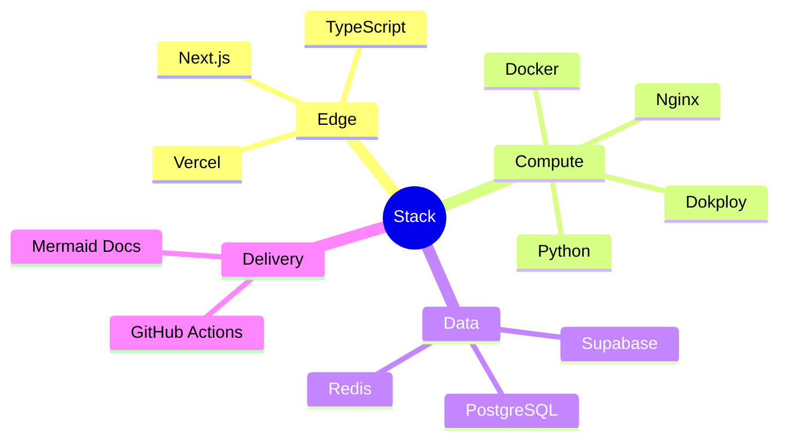

# Technology Choices

> For each technology: context, decision, alternatives, trade-off, and what changes in practice.

---

## Summary matrix

| Technology | Role | Primary reason |
|---|---|---|
| Next.js | Frontend framework | SSR/SSG + React ecosystem on Vercel |
| TypeScript | Frontend (/ shared types) | Type safety in UI and API contracts |
| Python | Backend & workers | Fast IO-bound services; rich data libs |
| Docker | Packaging | Consistent runtime across environments |
| Dokploy | Deploy orchestration | Low-ops Docker PaaS on own compute |
| GitHub Actions | CI/CD | Native SCM integration |
| Supabase | Auth + managed Postgres + storage | Speed with RLS primitives |
| PostgreSQL | System of record | Relational integrity + RLS |
| Redis | Queue / cache | Simple, fast broker |
| Nginx | Reverse proxy / TLS | Host-edge, battle-tested in production |
| Vercel | Frontend hosting | Global edge + preview deploys |
| Mermaid | Architecture diagrams | Text-based, reviewable in Git |

---

## Next.js

| | |
|---|---|
| **Context** | Need a modern web UI with strong SEO for marketing and authenticated app routes |
| **Decision** | Next.js App Router on Vercel |
| **Alternatives** | Remix, pure React SPA, SvelteKit |
| **Trade-offs** | Framework conventions vs flexibility; coupling to Vercel features if overused |
| **Consequences** | Fast UI delivery; keep heavy backend jobs out of Next.js server routes |

---

## TypeScript

| | |
|---|---|
| **Context** | UI complexity and risk of API contract drift |
| **Decision** | TypeScript on the frontend (and shared DTO types when applicable) |
| **Alternatives** | JavaScript, Flow |
| **Trade-offs** | Slightly more verbose; build step |
| **Consequences** | Fewer runtime contract bugs in the UI; more confidence in refactors |

---

## Python

| | |
|---|---|
| **Context** | IO-bound ingestion, parsing, orchestration workers |
| **Decision** | Python for API/workers |
| **Alternatives** | Node.js everywhere, Go, Java |
| **Trade-offs** | GIL for CPU-bound work; packaging discipline required |
| **Consequences** | Fast iteration; workers scale via processes/containers |

---

## Docker

| | |
|---|---|
| **Context** | Need reproducible deploys without “works on my machine” |
| **Decision** | Docker as the deploy unit |
| **Alternatives** | Bare systemd, Nix, unikernels |
| **Trade-offs** | Image maintenance; registry dependency |
| **Consequences** | Staging/prod parity; see [ADR 0001](ADR/0001-docker-over-kubernetes.md) |

---

## Dokploy

| | |
|---|---|
| **Context** | Team needs PaaS-style deploys on a VM without running raw K8s |
| **Decision** | Dokploy for container lifecycle on own compute |
| **Alternatives** | CapRover, Coolify, raw Compose + scripts, ECS |
| **Trade-offs** | Platform opinions; migration path must stay image-centric |
| **Consequences** | Lower ops load; images remain portable |

---

## GitHub Actions

| | |
|---|---|
| **Context** | CI/CD colocated with GitHub |
| **Decision** | GitHub Actions for all pipelines |
| **Alternatives** | GitLab CI, CircleCI, Buildkite |
| **Trade-offs** | Minutes cost; marketplace action supply-chain risk (pin versions!) |
| **Consequences** | Unified PR gates; security scans as required checks |

---

## Supabase

| | |
|---|---|
| **Context** | Need managed Postgres, auth, and storage quickly with tenancy |
| **Decision** | Supabase as data/auth plane |
| **Alternatives** | Self-managed Postgres + Keycloak, Firebase, PlanetScale + custom auth |
| **Trade-offs** | Vendor coupling; abstract via repositories |
| **Consequences** | Multi-tenancy with RLS first; see [ADR 0003](ADR/0003-supabase-selection.md) |

---

## PostgreSQL

| | |
|---|---|
| **Context** | Relational data with strong consistency and policy enforcement |
| **Decision** | PostgreSQL as system of record |
| **Alternatives** | MySQL, MongoDB, DynamoDB |
| **Trade-offs** | Write scale requires deliberate design |
| **Consequences** | Fits well with RLS and complex queries |

---

## Redis

| | |
|---|---|
| **Context** | Need a light queue and ephemeral cache |
| **Decision** | Redis for queues / short-lived state |
| **Alternatives** | RabbitMQ, SQS, NATS, Kafka |
| **Trade-offs** | Durability semantics must be configured on purpose |
| **Consequences** | Simple ops; revisit Kafka if event volume explodes |

---

## Nginx

| | |
|---|---|
| **Context** | TLS termination and reverse proxy on the compute host |
| **Decision** | Nginx in front of API containers |
| **Alternatives** | Caddy, Traefik, cloud LB only |
| **Trade-offs** | Config-as-code discipline required |
| **Consequences** | Mature hardening patterns; see the config template |

---

## Vercel

| | |
|---|---|
| **Context** | Global frontend delivery with low latency |
| **Decision** | Vercel for Next.js |
| **Alternatives** | Cloudflare Pages, Netlify, self-hosted Next |
| **Trade-offs** | Long-running backend work must stay off the edge |
| **Consequences** | Preview deploys; see [ADR 0002](ADR/0002-vercel-edge.md) |

---

## Mermaid

| | |
|---|---|
| **Context** | Architecture docs need to be reviewable in PRs |
| **Decision** | Mermaid diagrams in Markdown |
| **Alternatives** | Lucidchart, draw.io binaries, PlantUML |
| **Trade-offs** | Complex diagrams can get verbose |
| **Consequences** | Diffable diagrams; native GitHub rendering |

---

---

## Related documents

- [ADR/](ADR/)
- [ARCHITECTURE.md](ARCHITECTURE.md)
- [ROADMAP.md](../ROADMAP.md)
