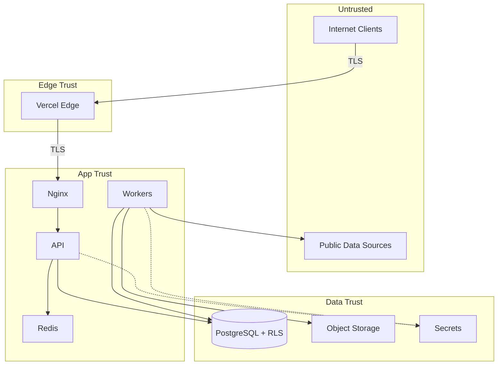
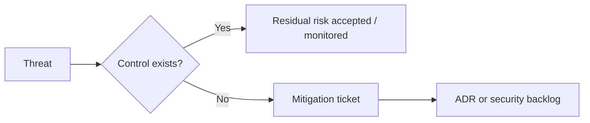

# Threat Model (STRIDE)

> STRIDE applied to Licitech's logical architecture. Assets and flows are generic — no production identifiers.

---

## 1. Assets

| Asset | Sensitivity | Notes |
|---|---|---|
| Tenant account credentials / sessions | Critical | Via IdP |
| Tenant business data (saved searches, workflows) | High | Multi-tenant isolation mandatory |
| Aggregated public procurement records | Medium | Public origin; integrity still matters |
| API / service signing secrets | Critical | Break-glass access |
| Build artifacts & deploy credentials | Critical | Supply chain |
| Logs / metrics | Medium | May contain metadata — scrub PII |

---

## 2. Actors

| Actor | Intent | Capability |
|---|---|---|
| Anonymous internet user | Curiosity / abuse | Unauthenticated HTTP |
| Authenticated tenant user | Legitimate / curious / malicious insider | Tenant-scoped API |
| Tenant admin | Privilege within the tenant | User management |
| External attacker | Data theft / ransomware / fraud | Scanning, exploit kits |
| Compromised dependency | Supply-chain foothold | Build-time / runtime |
| Insider operator | Mistake or malice | Prod access |
| Automated bots | Credential stuffing / scraping | Volumetric |

---

## 3. Trust boundaries

Crossing a boundary requires authentication, authorization, or explicit allowlisting.

---

## 4. Attack surface

| Surface | Exposure |
|---|---|
| Public HTTPS frontend | High |
| Public HTTPS API | High |
| Auth endpoints (IdP) | High |
| Webhooks (if any) | Medium — signature required |
| Worker egress to public sources | Medium — SSRF risk |
| Container registry / CI | High impact if compromised |
| Admin/orchestrator UI | High — IP allowlist / MFA |
| Redis / DB ports | Must be non-public |

---

## 5. Threat matrix (STRIDE)

| Element | Spoofing | Tampering | Repudiation | Info Disclosure | DoS | Elevation |
|---|---|---|---|---|---|---|
| Login / JWT | Stolen token | Token rewrite | Missing audit | Token in logs | Stuffing | Privilege claim forge |
| API | Fake client | Body tamper | No audit trail | Verbose errors | Flood | IDOR / role bypass |
| Workers | Fake job injection | Job payload alteration | No job audit | Secret in job | Queue flood | Worker → admin ops |
| DB | Bad role | Unauthorized UPDATE | No row audit | Cross-tenant read | Conn exhaustion | Superuser misuse |
| CI/CD | Rogue commit | Pipeline poison | Unsigned build | Secret leak in logs | Runner abuse | Prod deploy rights |
| Ingest | Spoofed source | Poisoned content | — | Sensitive reflect | Amplification | — |

---

## 6. Mitigations

### Spoofing

- TLS everywhere; validate JWT signature & issuer
- HMAC / webhook signature verification
- MFA for privileged operators

### Tampering

- Parameterized queries; artifact integrity (digest deploys)
- Immutable image tags; branch protection
- Input validation / schema checks

### Repudiation

- Structured audit logs for authZ failures and admin actions
- Correlation IDs retained across incident windows
- CI run identity tied to deploys

### Information Disclosure

- RLS + least privilege
- Generic error messages to clients; details in logs
- Security headers; no debug in production
- Log redaction

### Denial of Service

- Rate limits at edge and API
- Connection / body-size limits
- Worker concurrency caps; queue max-length alerts
- Resource limits on containers

### Elevation of Privilege

- RBAC + RLS in defense in depth
- No Docker socket in apps
- Separated CI roles; environment-protected secrets
- Disable dangerous debug endpoints

---

## 7. Residual risks

| Risk | Why residual | Monitoring |
|---|---|---|
| Dependency zero-day | Detection lag | SBOM + fast patch SLA |
| IdP regional outage | External dependency | Status + limited cached-session grace |
| Upstream source HTML/JS poison | Hostile content by nature | Sanitize; rendering sandbox |
| Insider with break-glass | Required for ops | Audit + dual control |
| Single-region compute | Cost/complexity trade-off | DR runbooks; multi-region roadmap |

---

## 8. Review cadence

- Full STRIDE refresh: **semiannual** or on major architecture change
- Delta review: on every significant ADR that touches trust boundaries
- Penetration test: periodic third-party (organizational policy)

---

## Related documents

- [SECURITY_AND_COMPLIANCE.md](SECURITY_AND_COMPLIANCE.md)
- [ARCHITECTURE.md](ARCHITECTURE.md)
- [ADR/](ADR/)
