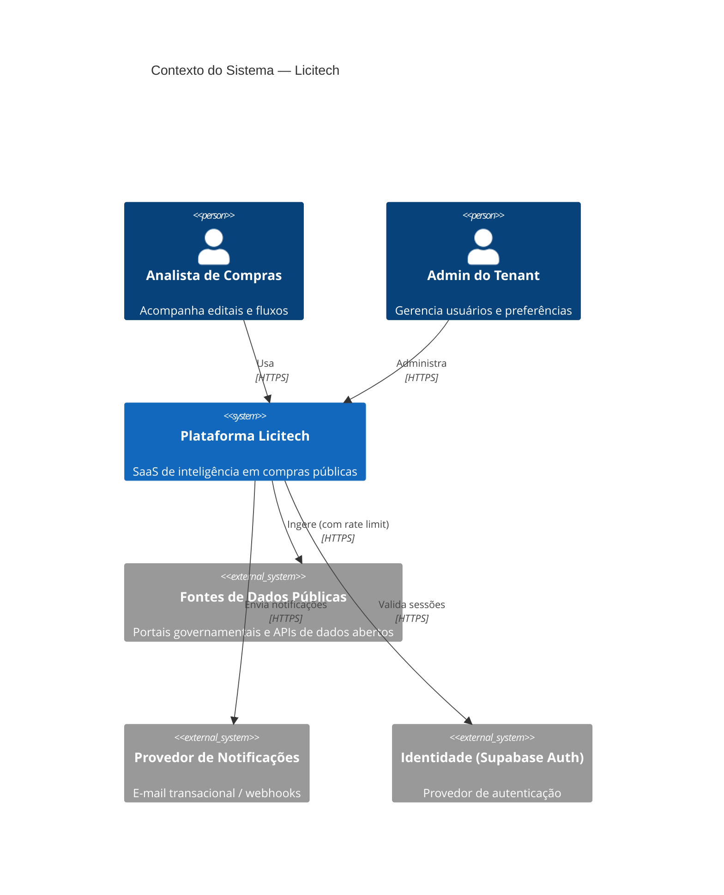
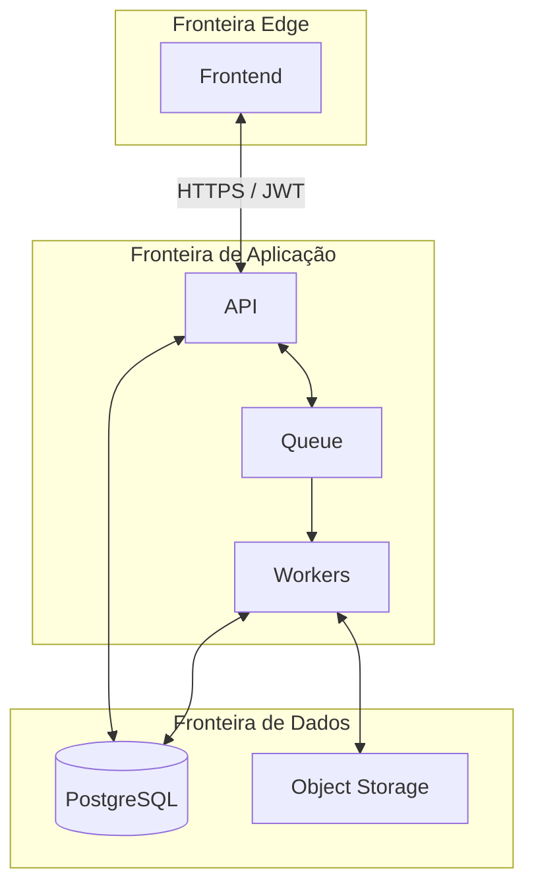
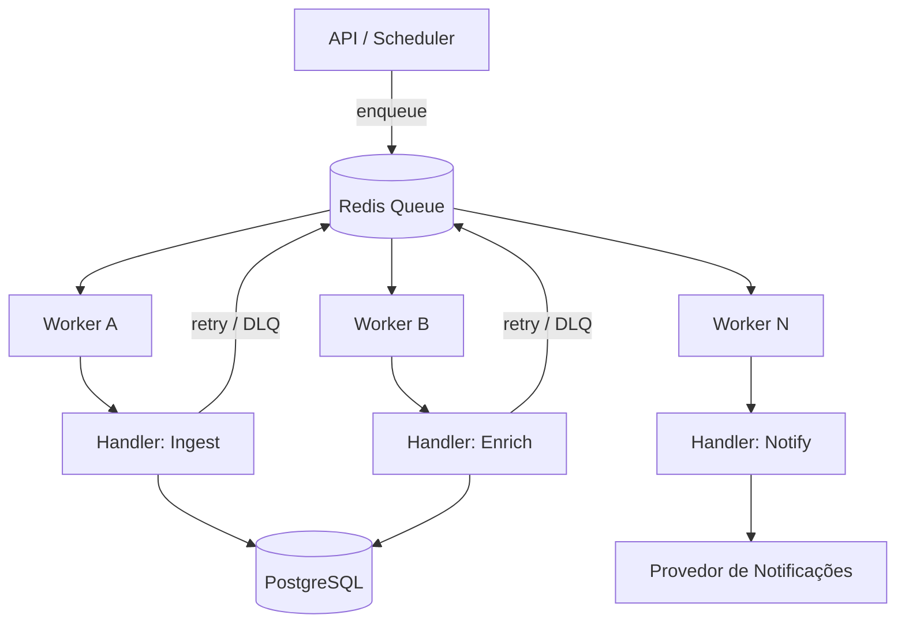
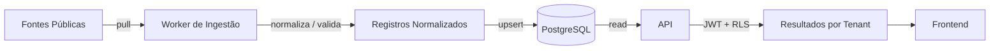
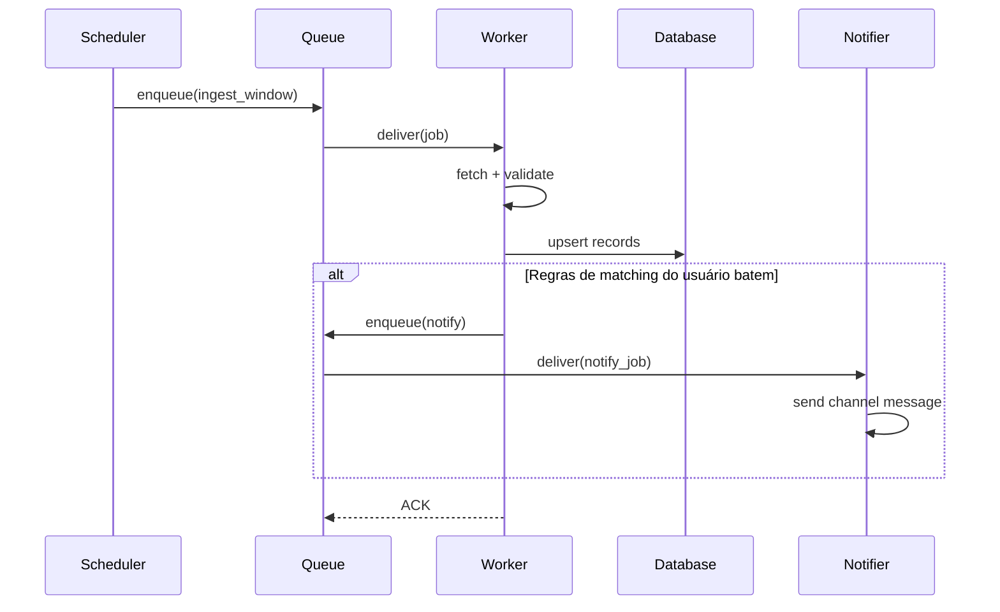
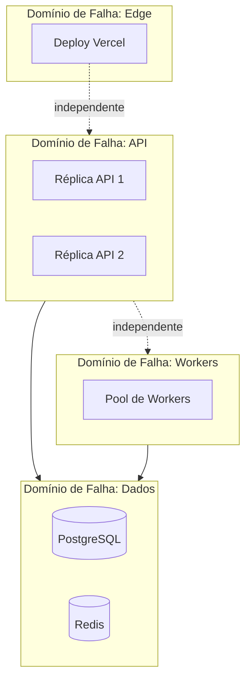
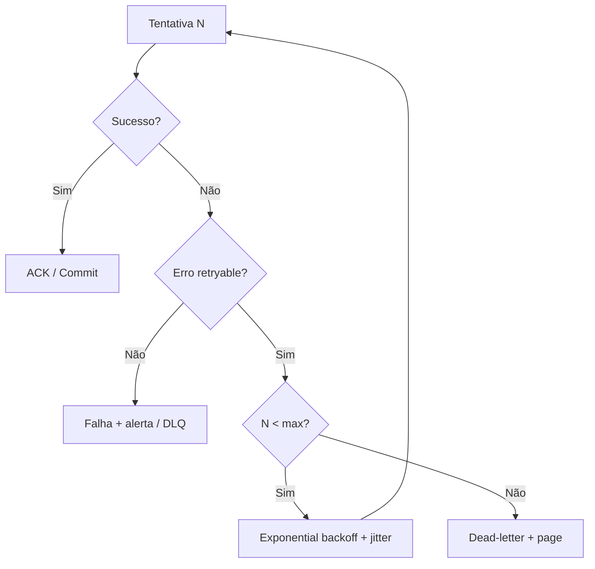
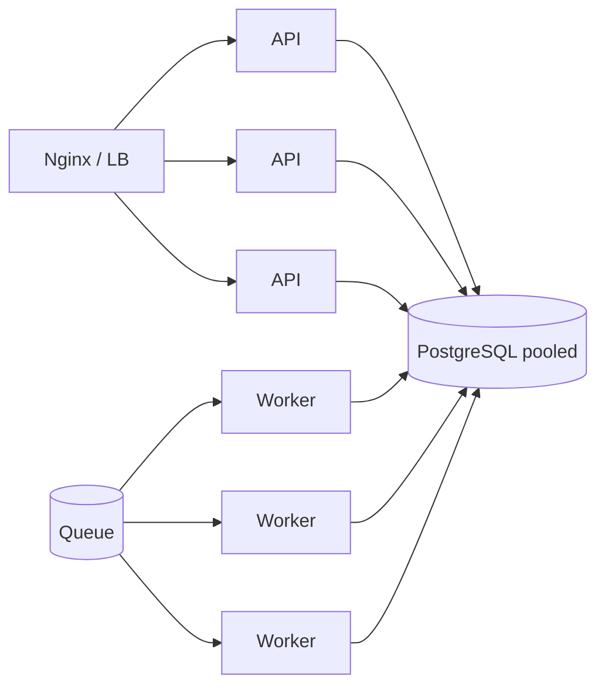

# Arquitetura

> **Idioma:** [English](../ARCHITECTURE.md) · Português (Brasil)

> Documentação de arquitetura sanitizada: sem schemas proprietários, endpoints reais ou detalhes de implementação.

---

## 1. Contexto do sistema

A Licitech é um SaaS multi-tenant que agrega e organiza **sinais de compras públicas** (editais, avisos, referências legislativas) e os disponibiliza em fluxos web autenticados.

> [!NOTE]
> Adaptadores de fontes externas são tratados como **I/O não confiável**. Todo conteúdo ingerido é validado, normalizado e armazenado sob políticas por tenant antes de chegar ao usuário.

---

## 2. Fronteiras de serviço

| Fronteira | Responsabilidade | Isolamento de falha |
|---|---|---|
| **Edge UI** | Renderização, roteamento no client, gates de auth no edge | UI degradada sem travar workers |
| **API** | Commands/queries síncronos, authZ | Reinicia independente dos workers |
| **Workers** | Ingestão, enriquecimento, notificações | Crash loops não derrubam a API |
| **Queue** | Buffer e semântica de retry | Back-pressure protege as fontes upstream |
| **Data plane** | Estado durável, RLS, storage | PITR / backups independentes do compute |

---

## 3. Componentes do backend

| Componente | Papel | Estado |
|---|---|---|
| **Processo da API** | Superfície REST/JSON (ou RPC); validação; orquestração | Stateless |
| **Auth middleware** | Verificação de JWT, extração de claims, vínculo ao tenant | Stateless |
| **Domain services** | Orquestração de casos de uso (sem SQL direto nos controllers) | Stateless |
| **Camada de repositório** | Abstração de persistência | Stateless |
| **Worker runners** | Consomem jobs; handlers idempotentes | Stateless |
| **Scheduler / poller** | Enfileira janelas periódicas de ingestão | Stateless |

> [!TIP]
> Controllers ficam magros. Regras de domínio ficam nos services. Persistência é trocável atrás dos repositórios — assim Supabase/Postgres fica como detalhe de implementação do data plane.

---

## 4. Arquitetura de workers

Workers são **processos com escala horizontal** consumindo de uma queue compartilhada.

**Regras de design**

1. **Idempotency keys** em todo job — a gente assume entrega at-least-once
2. **Retries limitados** com exponential backoff + jitter
3. Caminho de **dead-letter** para poison messages depois do máximo de tentativas
4. **Visibility timeout** para workers que crasham não deixarem jobs órfãos
5. **Sem memória mutável compartilhada** entre workers

---

## 5. Fluxo de dados

**Princípios**

- O caminho de escrita é orientado a append/upsert; atualizações são auditáveis quando necessário
- O caminho de leitura é filtrado por RLS no banco — filtros na aplicação são a segunda linha, não a única
- Payloads grandes (anexos, snapshots brutos) vão para object storage; o DB guarda referências e metadados

---

## 6. Fluxo de eventos

Eventos são **commands numa queue**, não um event bus completo — escolhido pela simplicidade operacional na escala atual. Veja o [roadmap de ADRs](../../ROADMAP-pt-br.md) para quando faria sentido reconsiderar um backbone de eventos mais rico.

---

## 7. Processamento da queue

| Preocupação | Abordagem |
|---|---|
| Entrega | At-least-once |
| Ordenação | Por partição / por chave de entidade quando necessário; senão best-effort |
| Back-pressure | Métricas de profundidade da queue → escala workers / descarta jobs não críticos |
| Poison messages | Máximo de retries → dead-letter + alerta |
| Observabilidade | Correlation de job ID nos logs: API → queue → worker |

---

## 8. Design stateless

Todos os processos de aplicação são **stateless**:

- Sem session store em processo
- Sem sticky sessions no load balancer
- Configuração via environment (injetada em runtime)
- Escala horizontal = número de réplicas

Estado durável:

| Store | Conteúdo |
|---|---|
| PostgreSQL | Entidades canônicas, tenancy, atributos de authz |
| Redis | Queue / cache de curta duração / contadores de rate limit |
| Object storage | Blobs e artefatos brutos |

---

## 9. Isolamento de falhas

| Falha | Raio de impacto | Mitigação |
|---|---|---|
| Crash de um container da API | Requests em voo naquela réplica | Restart policy + multi-réplica |
| Saturação do pool de workers | Jobs assíncronos atrasados | Scale out; descarta trabalho de baixa prioridade |
| Redis indisponível | Queue pausa | Alertas; modo degradado (só caminhos sync críticos, se definidos) |
| Postgres indisponível | Outage total de leitura/escrita | Fail closed; restore de backup / PITR |

---

## 10. Rate limiting

| Camada | Mecanismo | Propósito |
|---|---|---|
| Edge | Regras da plataforma / WAF | Abuso volumétrico |
| API | Orçamentos por token / IP / tenant | Uso justo e controle de custo |
| Workers | Limites de educação por fonte | Proteger APIs públicas upstream |
| Database | Caps de pool | Evitar connection storms |

Quando o limite estoura, a gente devolve erros explícitos e amigáveis a retry (ex.: `429` com semântica de `Retry-After` quando aplicável).

---

## 11. Estratégia de retry

- Distinguir **transitório** (timeouts, 503) de **permanente** (validação, 404)
- Limitar tentativas totais; nunca retry infinito no hot path
- Idempotency tokens evitam side effects duplicados

---

## 12. Alta disponibilidade

| Camada | Postura de HA |
|---|---|
| Frontend | Rede edge multi-AZ (Vercel) |
| API | N ≥ 2 réplicas atrás de reverse proxy |
| Workers | N ≥ 2; a queue absorve outages curtos |
| PostgreSQL | HA gerenciado / failover automático (provedor) |
| Redis | Modo de persistência adequado à durabilidade da queue |

Endpoints de health (`/health/live`, `/health/ready`) controlam tráfego e restarts da orquestração.

---

## 13. Escala horizontal

Gatilhos de escala (manual hoje; automatizado no roadmap):

- API: CPU / latência p95 / RPS
- Workers: profundidade da queue / lag / idade do job

---

## 14. Domínios de falha — resumo

| Domínio | Contém | Restart independente? |
|---|---|---|
| Edge | Deploy Next.js | Sim |
| Proxy | Nginx | Sim |
| API | Containers da aplicação | Sim |
| Workers | Consumidores de jobs | Sim |
| Cache/Queue | Redis | Sim (com risco de drain da queue) |
| Dados | PostgreSQL + storage | Orientado a restore |

---

## Documentos relacionados

- [C4 Context](C4/CONTEXT.md) · [Container](C4/CONTAINER.md) · [Component](C4/COMPONENT.md)
- [SCALABILITY.md](SCALABILITY.md) · [PERFORMANCE.md](PERFORMANCE.md)
- [THREAT_MODEL.md](THREAT_MODEL.md) · [ADR/](ADR/)
