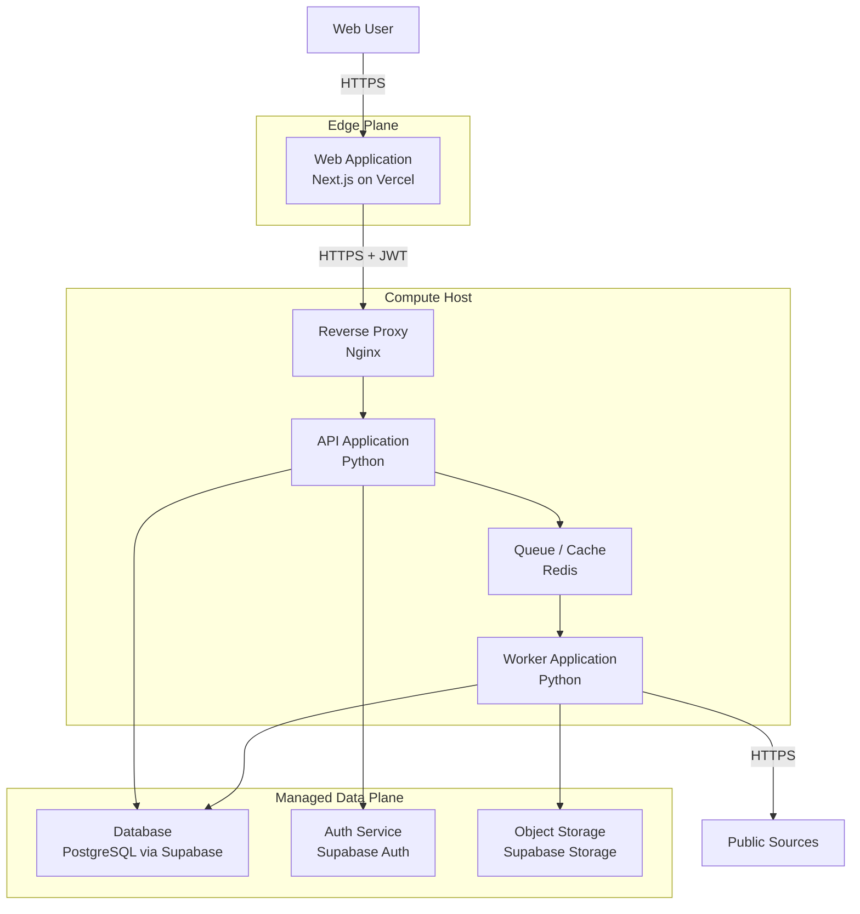
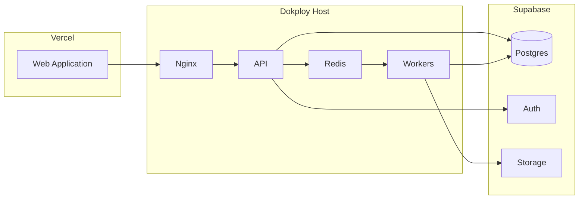

# C4 — Containers

> **Idioma:** [English](../../C4/CONTAINER.md) · Português (Brasil)

> **Nível 2.** Unidades que sobem e rodam de forma independente, e como elas se falam. Só nomes sanitizados.

---

## Para que serve

Descrever os principais **containers** no sentido C4 (não só Docker): aplicações e stores que dá para deployar e raciocinar separados.

---

## Diagrama de containers

---

## Catálogo de containers

| Container | Tecnologia | Responsabilidades |
|---|---|---|
| Web Application | Next.js / TypeScript | UI, edge middleware, chama a API |
| Reverse Proxy | Nginx | Término de TLS, roteamento, headers |
| API Application | Python | Commands/queries síncronos, authZ, enqueue |
| Worker Application | Python | Jobs assíncronos: ingest, enrich, notify |
| Queue / Cache | Redis | Broker de jobs, cache efêmero, contadores de rate |
| Database | PostgreSQL | System of record + RLS |
| Auth Service | Supabase Auth | Identidade, tokens |
| Object Storage | Supabase Storage | Blobs / artefatos |

---

## Resumo de comunicação

| De | Para | Protocolo | Auth |
|---|---|---|---|
| Web → Proxy/API | HTTPS | JWT / session |
| API → Redis | TCP interno | Isolamento de rede |
| API → Postgres | TLS | Credenciais de DB + contexto RLS |
| Worker → Sources | HTTPS | N/A (público) + allowlists |
| Worker → Storage | HTTPS | Credenciais de serviço |

---

## Mapeamento de deploy

---

## Relacionados

- [CONTEXT.md](CONTEXT.md)
- [COMPONENT.md](COMPONENT.md)
- [ADR 0001](../ADR/0001-docker-over-kubernetes.md)
- [ADR 0002](../ADR/0002-vercel-edge.md)
