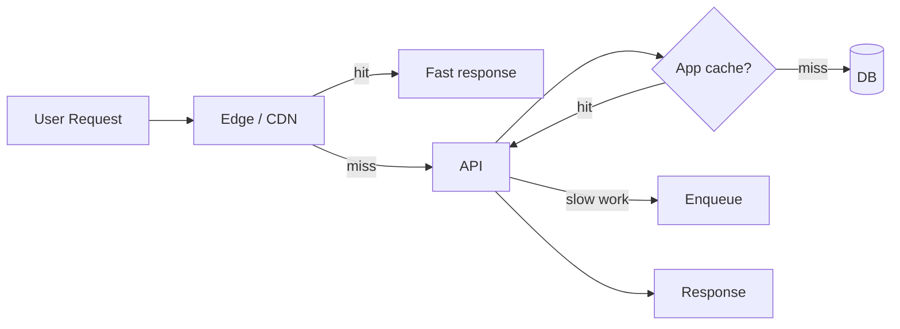
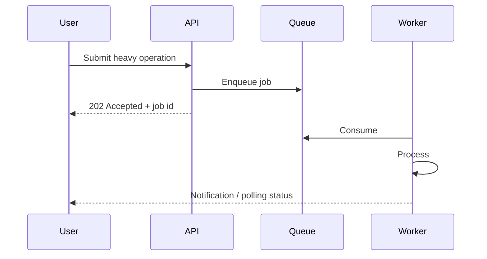

# Performance

> **Idioma:** [English](../PERFORMANCE.md) · Português (Brasil)

> Manter o caminho do usuário rápido: trabalho lento fora da request e cache agressivo na edge.

---

## 1. Princípios de otimização de performance

1. **Meça antes de otimizar** — p95/p99 > médias
2. **Otimize o caminho síncrono** — o resto vai async
3. **Cache com corretude** — isolamento de tenant primeiro
4. **Limite o trabalho** — timeouts, limites de payload, paginação
5. **Prefira clareza sequencial a micro-otimizações prematuras**

---

## 2. Edge rendering

- Next.js na Vercel: static generation / SSR / edge middleware conforme a rota
- Personalização fica atrás de auth; páginas públicas de marketing maximizadas para entrega estática
- Evite bloquear o TTFB em calls downstream não críticas

---

## 3. CDN

| Tipo de asset | Estratégia |
|---|---|
| JS/CSS com content hash | Cache longo, immutable |
| Imagens | Transforms de CDN / formatos modernos quando disponíveis |
| Respostas de API | Em geral `Cache-Control: private` / curto ou no-store para dados autenticados |

---

## 4. Caching

Veja também [SCALABILITY.md](SCALABILITY.md). Notas específicas de performance:

- Proteção contra stampede (single-flight) em hot keys
- Negative caching para known-misses com TTL curto
- Prefira cache-aside pela simplicidade na escala atual

---

## 5. Compression

- Gzip/Brotli no CDN e no reverse proxy para assets de texto
- Evite comprimir binários já comprimidos
- Respostas JSON ganham de verdade em redes mobile

---

## 6. Reuso de conexão

- Keep-alive para a API upstream a partir do edge
- HTTP connection pooling em clients server-side
- Conexões persistentes de DB via pooler — não uma conexão por request sem pooling

---

## 7. Processamento em background

| No caminho da request | Offloaded para workers |
|---|---|
| AuthZ + read/write primário | Ingestão em bulk |
| Fan-out pequeno de notificações (opcional) | Exports grandes |
| Acknowledgements idempotentes | Pipelines de enrichment |

Esse split é a maior alavanca estrutural de performance na arquitetura.

---

## 8. Otimização de database

| Prática | Intenção |
|---|---|
| Caminhos de acesso indexados para queries quentes | p95 estável |
| Paginação (`LIMIT`/`KEYSET`) | Limitar tamanho da resposta |
| Evitar N+1 | Batch / join de propósito |
| Analisar slow query logs | Melhoria contínua |
| Separar carga analítica | Proteger OLTP (read replica no futuro) |

---

## 9. Processamento async

Clients recebem acknowledgements rápidos; usuários acompanham progresso via endpoints de status ou notificações.

---

## Orçamentos de performance (ilustrativos)

| Superfície | Orçamento (ilustrativo) |
|---|---|
| LCP de marketing | < 2.5s em mobile mid-tier |
| Lista autenticada p95 | < 500 ms server-side |
| Enqueue ACK | < 100 ms |
| Job de worker (ingest mediano) | Depende do domínio; acompanhado como SLO |

> [!NOTE]
> Os orçamentos acima são **alvos arquiteturais**, não medições de produção deste repositório.

---

## Documentos relacionados

- [ARCHITECTURE.md](ARCHITECTURE.md)
- [SCALABILITY.md](SCALABILITY.md)
- [OBSERVABILITY.md](OBSERVABILITY.md)
