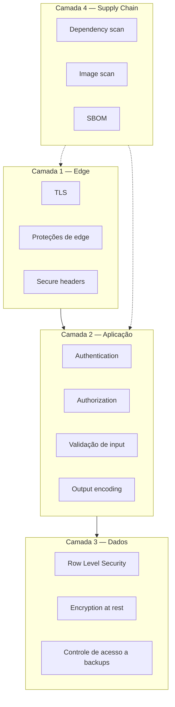
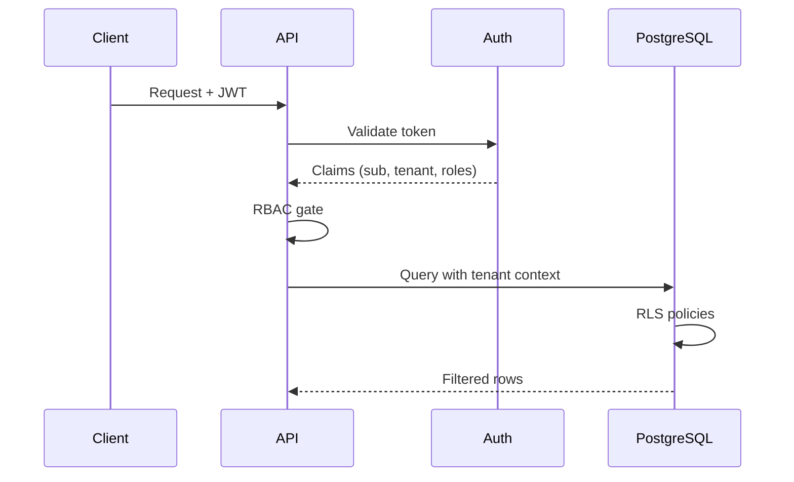
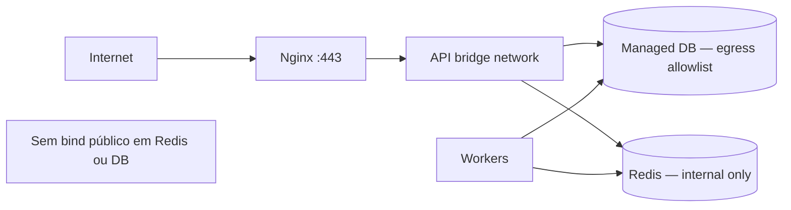

# Segurança & Compliance

> **Idioma:** [English](../SECURITY_AND_COMPLIANCE.md) · Português (Brasil)

> Documentação pública de segurança da arquitetura. Sem secrets reais, certificados ou identificadores de produção.

---

## 1. Visão da postura de segurança

A Licitech trabalha com **defense in depth** e pressupostos de **zero-trust** entre camadas. Cada hop autentica e autoriza — só estar na rede nunca basta.

---

## 2. Gestão de secrets

| Prática | Detalhe |
|---|---|
| Sem secrets no git | Garantido por `.gitignore` + secret scanning |
| Injeção em runtime | Environment / secret store no start do processo |
| Rotação | Rotação documentada de signing keys e credenciais de DB |
| Exposição mínima | Workers recebem só os secrets que precisam |
| Audit | Acesso a secrets de produção é logado |

> [!CAUTION]
> Arquivos de exemplo (`env.example`) contêm **somente placeholders**. Nunca copie valores de produção para este repositório.

**Roadmap:** Secrets Manager centralizado com credenciais de curta duração (veja [ROADMAP.md](../../ROADMAP-pt-br.md)).

---

## 3. Variáveis de ambiente

- Separadas por ambiente (`development`, `staging`, `production`)
- Validação tipada no boot — o processo recusa subir se faltar chave obrigatória
- Distinção entre config **pública** (feature flags) e config **secreta** (credenciais)

---

## 4. JWT

| Tópico | Abordagem |
|---|---|
| Emissão | Identity provider (Supabase Auth) |
| Validação | Assinatura, `exp`, checks de `aud` / issuer na API |
| Storage (browser) | Cookies HttpOnly secure preferidos a `localStorage` quando viável |
| Rotação | Rotação de signing key suportada pelo provedor |
| Revogação | TTL curto + refresh; invalidação de sessão server-side quando necessário |

---

## 5. Authentication

- IdP centralizado — a aplicação não guarda password hashes quando o auth é gerenciado pelo provedor
- MFA disponível na camada do IdP para tenants privilegiados (depende da política)
- Mitigações de session fixation e CSRF em fluxos baseados em cookie

---

## 6. Authorization

| Modelo | Uso |
|---|---|
| Role-based (RBAC) | Permissões grosseiras (admin, member, viewer) |
| Isolamento de tenant | Claim de tenant obrigatória em toda request |
| Checks de recurso | Checks no nível do objeto na camada de domínio |
| Defense in depth | RLS garante tenancy mesmo se houver bug na app |

---

## 7. Row Level Security (RLS)

- Habilitado em tabelas pertencentes ao tenant
- Policies vinculadas a JWT claims / variáveis de sessão do DB
- Service role reservado a workers confiáveis, com uso auditado
- Código da aplicação nunca “desliga RLS” em caminhos voltados ao usuário

---

## 8. Isolamento de containers

- Usuário não-root
- Root filesystem read-only quando prático
- Linux capabilities dropadas
- Sem Docker socket montado em containers da app
- Resource limits (CPU / memória) para conter noisy neighbors

---

## 9. Isolamento de rede

- Redis e portas internas de admin **não** publicadas na internet
- Egress dos workers controlado para fetch de fontes
- Frontend fala só com o hostname público da API sobre TLS

---

## 10. Least privilege

| Ator | Privilégio |
|---|---|
| Usuário anônimo | Só rotas públicas de marketing |
| Usuário autenticado | Dados do próprio tenant |
| Admin do tenant | Gestão de usuários do tenant |
| Service role do worker | Tabelas / operações estreitas exigidas pelos jobs |
| Role de deploy do CI | Push de imagens + deploy — sem admin de DB |

---

## 11. OWASP Top 10 — mapeamento

| Risco | Mitigação |
|---|---|
| Broken Access Control | RBAC + RLS + testes |
| Cryptographic Failures | TLS em tudo; secrets gerenciados; sem crypto caseira |
| Injection | Queries parametrizadas; validação estrita |
| Insecure Design | Threat model + ADRs |
| Security Misconfiguration | Imagens endurecidas; secure headers; baselines orientadas a CIS |
| Vulnerable Components | Scan de dependência + imagem no CI |
| Auth Failures | Boas práticas do IdP; MFA para ops privilegiadas |
| Software & Data Integrity | Deps assinadas/travadas; artefatos imutáveis |
| Logging Failures | Logs estruturados relevantes à segurança (sem secrets) |
| SSRF | Allowlists de egress; bloquear IPs link-local / de metadata |

---

## 12. Dependency scanning

- Lockfiles commitados
- CI falha no limiar de severidade
- Updates estilo Dependabot / Renovate (depende do processo)
- Revisar licenses para compliance

---

## 13. Image scanning

- Scan de toda imagem antes da promoção
- Updates de imagem base em cadência
- Sem `latest` em deploys de produção

---

## 14. Segurança da supply chain

| Controle | Status |
|---|---|
| Dependências travadas | Obrigatório |
| CI em runners confiáveis | Obrigatório |
| Build context mínimo | Obrigatório |
| Geração de SBOM | Artefato do pipeline |
| Provenance / attestations | Roadmap |

---

## 15. SBOM

- Gerado por build (CycloneDX ou SPDX)
- Retido com o artefato de release
- Usado para análise rápida de impacto quando cai um CVE

---

## 16. Proteção contra prompt injection

Onde existirem (ou forem planeados) recursos assistidos por LLM:

- Tratar output do modelo como **não confiável**
- Separar system instructions de conteúdo do usuário/recuperado
- Sem invocação de tools a partir do output do modelo sem actions allowlisted
- Sanitizar conteúdo recuperado da web pública antes do prompt

---

## 17. Proteção contra SQL injection

- Só ORM / query builder ou parâmetros bound
- Sem SQL concatenado a partir de input do usuário
- Item de checklist em code review; regras de SAST

---

## 18. Proteção contra XSS

- Encoding padrão do framework (React / Next.js)
- `Content-Security-Policy` estrito
- Evitar `dangerouslySetInnerHTML` a menos que sanitizado e justificado

---

## 19. Proteção contra CSRF

- Cookies SameSite
- CSRF tokens em rotas cookie-auth que mudam estado
- Preferir padrões de authorization header para clients de API puros

---

## 20. Validação de input

- Validação de schema na fronteira da API (ex.: Zod / equivalentes Pydantic)
- Rejeitar fields inesperados quando fizer sentido
- Upload de arquivo: limites de tipo, tamanho e content sniffing

---

## 21. Output encoding

- Encoding consciente de contexto para HTML, JSON, URLs
- Nunca refletir HTML bruto de fontes públicas em contextos privilegiados sem sanitização

---

## 22. Secure headers

| Header | Propósito |
|---|---|
| `Strict-Transport-Security` | Forçar HTTPS |
| `Content-Security-Policy` | Reduzir raio de XSS |
| `X-Content-Type-Options` | nosniff |
| `Referrer-Policy` | Limitar vazamento |
| `Permissions-Policy` | Desligar features de browser não usadas |
| `Frame-Ancestors` / `X-Frame-Options` | Clickjacking |

Veja [`nginx.example.conf`](../../config-templates/nginx.example.conf).

---

## 23. Considerações de LGPD

| Princípio | Aplicação |
|---|---|
| Limitação de finalidade | Coletar só o necessário para o serviço |
| Minimização | Preferir dados públicos de compras; limitar PII |
| Acesso e exclusão | Fluxos de admin do tenant + runbooks de suporte |
| Segurança | Encryption, access control, logging |
| Notificação de incidente | Playbook de resposta a incidente com revisão jurídica |
| Processadores | DPA com subprocessadores (hosting, e-mail, auth) |

> [!NOTE]
> Esta seção é orientação arquitetural — não é aconselhamento jurídico. DPIAs formais e revisão por assessoria jurídica são necessários para claims de compliance em produção.

---

## 24. Defense in depth

Nenhum controle sozinho é confiável. Exemplo: mesmo com autorização perfeita na API, RLS continua obrigatório; mesmo com RLS, isolamento de rede ainda se aplica.

---

## 25. Zero trust

- Autenticar toda request
- Autorizar todo acesso a recurso
- Encrypt in transit
- Assumir breach: limitar movimento lateral via segmentação e least privilege

---

## Documentos relacionados

- [THREAT_MODEL.md](THREAT_MODEL.md)
- [DEVOPS_AND_CICD.md](DEVOPS_AND_CICD.md)
- [OBSERVABILITY.md](OBSERVABILITY.md)
