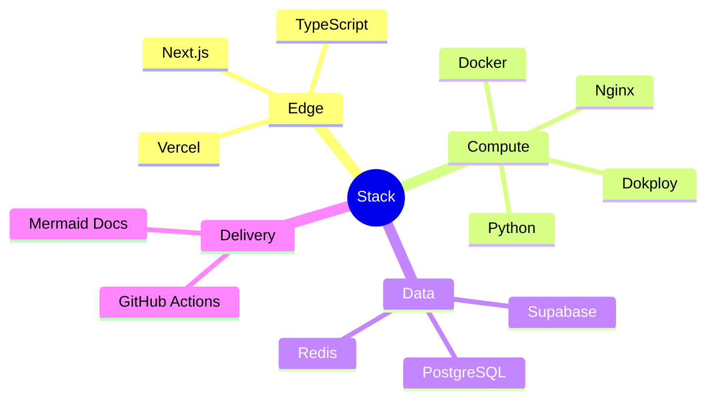

# Escolhas de tecnologia

> **Idioma:** [English](../TECHNOLOGY_CHOICES.md) · Português (Brasil)

> Para cada tecnologia: o contexto, a decisão, as alternativas, o trade-off e o que muda na prática.

---

## Matriz-resumo

| Tecnologia | Papel | Motivo principal |
|---|---|---|
| Next.js | Framework frontend | SSR/SSG + ecossistema React na Vercel |
| TypeScript | Frontend (/ tipos compartilhados) | Type safety na UI e nos contratos de API |
| Python | Backend & workers | Serviços IO-bound rápidos; libs ricas de dados |
| Docker | Packaging | Runtime consistente entre ambientes |
| Dokploy | Orquestração de deploy | PaaS Docker low-ops em compute próprio |
| GitHub Actions | CI/CD | Integração nativa com o SCM |
| Supabase | Auth + Postgres gerenciado + storage | Velocidade com primitives de RLS |
| PostgreSQL | System of record | Integridade relacional + RLS |
| Redis | Queue / cache | Broker simples e rápido |
| Nginx | Reverse proxy / TLS | Edge no host, já batido em produção |
| Vercel | Hosting do frontend | Edge global + preview deploys |
| Mermaid | Diagramas de arquitetura | Baseado em texto, revisável no Git |

---

## Next.js

| | |
|---|---|
| **Contexto** | Precisa de UI web moderna com SEO forte para marketing e rotas autenticadas da app |
| **Decisão** | Next.js App Router na Vercel |
| **Alternativas** | Remix, React SPA puro, SvelteKit |
| **Trade-offs** | Convenções do framework vs flexibilidade; acoplamento a features da Vercel se exagerar |
| **Consequências** | Entrega rápida de UI; manter jobs pesados de backend fora das server routes do Next.js |

---

## TypeScript

| | |
|---|---|
| **Contexto** | Complexidade de UI e risco de drift nos contratos de API |
| **Decisão** | TypeScript no frontend (e tipos DTO compartilhados quando aplicável) |
| **Alternativas** | JavaScript, Flow |
| **Trade-offs** | Um pouco mais verboso; passo de build |
| **Consequências** | Menos bugs de contrato em runtime na UI; mais confiança em refactors |

---

## Python

| | |
|---|---|
| **Contexto** | Ingestão IO-bound, parsing, workers de orquestração |
| **Decisão** | Python para API/workers |
| **Alternativas** | Node.js em tudo, Go, Java |
| **Trade-offs** | GIL para CPU-bound; disciplina de packaging necessária |
| **Consequências** | Iteração rápida; workers escalam via processos/containers |

---

## Docker

| | |
|---|---|
| **Contexto** | Precisa de deploys reproduzíveis sem “funciona na minha máquina” |
| **Decisão** | Docker como unidade de deploy |
| **Alternativas** | systemd bare, Nix, unikernels |
| **Trade-offs** | Manutenção de imagens; dependência de registry |
| **Consequências** | Paridade entre staging/prod; veja [ADR 0001](ADR/0001-docker-over-kubernetes.md) |

---

## Dokploy

| | |
|---|---|
| **Contexto** | Time precisa de deploys estilo PaaS numa VM sem rodar K8s cru |
| **Decisão** | Dokploy para lifecycle de containers em compute próprio |
| **Alternativas** | CapRover, Coolify, Compose cru + scripts, ECS |
| **Trade-offs** | Opiniões da plataforma; o caminho de migração precisa continuar image-centric |
| **Consequências** | Menos carga de ops; imagens continuam portáveis |

---

## GitHub Actions

| | |
|---|---|
| **Contexto** | CI/CD colocalizado com o GitHub |
| **Decisão** | GitHub Actions para todos os pipelines |
| **Alternativas** | GitLab CI, CircleCI, Buildkite |
| **Trade-offs** | Custo de minutos; risco de supply chain das actions do marketplace (pine versões!) |
| **Consequências** | Gates unificados de PR; security scans como required checks |

---

## Supabase

| | |
|---|---|
| **Contexto** | Precisa de Postgres gerenciado, auth e storage rápido com tenancy |
| **Decisão** | Supabase como data/auth plane |
| **Alternativas** | Postgres self-managed + Keycloak, Firebase, PlanetScale + auth custom |
| **Trade-offs** | Acoplamento de vendor; abstrair via repositórios |
| **Consequências** | Multi-tenancy com RLS first; veja [ADR 0003](ADR/0003-supabase-selection.md) |

---

## PostgreSQL

| | |
|---|---|
| **Contexto** | Dados relacionais com consistência forte e enforcement de políticas |
| **Decisão** | PostgreSQL como system of record |
| **Alternativas** | MySQL, MongoDB, DynamoDB |
| **Trade-offs** | Escala de writes exige design deliberado |
| **Consequências** | Encaixa bem com RLS e queries complexas |

---

## Redis

| | |
|---|---|
| **Contexto** | Precisa de queue leve e cache efêmero |
| **Decisão** | Redis para queues / estado de curta duração |
| **Alternativas** | RabbitMQ, SQS, NATS, Kafka |
| **Trade-offs** | Semântica de durabilidade precisa ser configurada de propósito |
| **Consequências** | Ops simples; revisitar Kafka se o volume de eventos explodir |

---

## Nginx

| | |
|---|---|
| **Contexto** | Terminação TLS e reverse proxy no host de compute |
| **Decisão** | Nginx na frente dos containers da API |
| **Alternativas** | Caddy, Traefik, só cloud LB |
| **Trade-offs** | Disciplina de config as code necessária |
| **Consequências** | Padrões maduros de hardening; veja o template de config |

---

## Vercel

| | |
|---|---|
| **Contexto** | Entrega global de frontend com baixa latência |
| **Decisão** | Vercel para Next.js |
| **Alternativas** | Cloudflare Pages, Netlify, Next self-host |
| **Trade-offs** | Trabalho de backend de longa duração precisa ficar fora do edge |
| **Consequências** | Preview deploys; veja [ADR 0002](ADR/0002-vercel-edge.md) |

---

## Mermaid

| | |
|---|---|
| **Contexto** | Docs de arquitetura precisam ser revisáveis em PRs |
| **Decisão** | Diagramas Mermaid em Markdown |
| **Alternativas** | Lucidchart, binários draw.io, PlantUML |
| **Trade-offs** | Diagramas complexos podem ficar verbosos |
| **Consequências** | Diagramas com diff; render nativo no GitHub |

---

---

## Documentos relacionados

- [ADR/](ADR/)
- [ARCHITECTURE.md](ARCHITECTURE.md)
- [ROADMAP.md](../../ROADMAP-pt-br.md)
