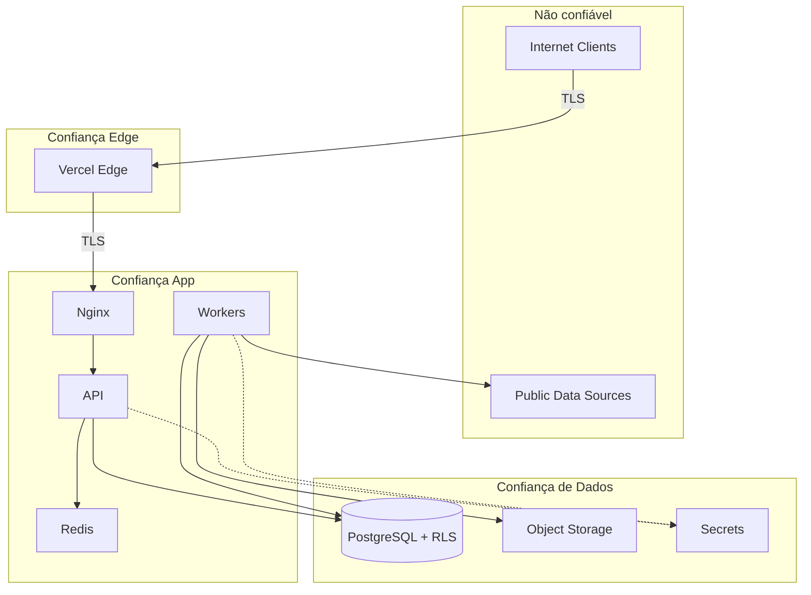
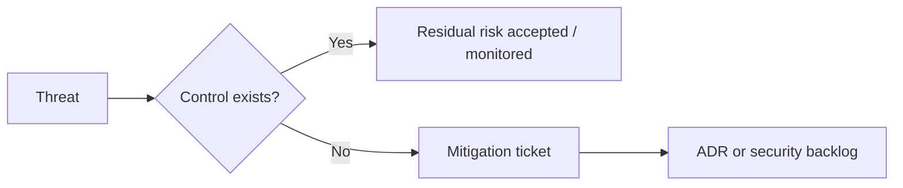

# Threat Model (STRIDE)

> **Idioma:** [English](../THREAT_MODEL.md) · Português (Brasil)

> STRIDE aplicado à arquitetura lógica da Licitech. Ativos e fluxos são genéricos — sem identificadores de produção.

---

## 1. Ativos

| Ativo | Sensibilidade | Notas |
|---|---|---|
| Credenciais / sessões de conta do tenant | Critical | Via IdP |
| Dados de negócio do tenant (buscas salvas, workflows) | High | Isolamento multi-tenant obrigatório |
| Registros agregados de compras públicas | Medium | Origem pública; integridade ainda importa |
| Secrets de assinatura da API / de serviço | Critical | Acesso break-glass |
| Artefatos de build & credenciais de deploy | Critical | Supply chain |
| Logs / metrics | Medium | Podem conter metadados — scrub PII |

---

## 2. Atores

| Ator | Intenção | Capacidade |
|---|---|---|
| Usuário anônimo da internet | Curiosidade / abuso | HTTP não autenticado |
| Usuário autenticado do tenant | Legítimo / curioso / insider malicioso | API escopada ao tenant |
| Admin do tenant | Privilégio dentro do tenant | Gestão de usuários |
| Atacante externo | Roubo de dados / ransomware / fraude | Scanning, exploit kits |
| Dependência comprometida | Ponto de apoio na supply chain | Build-time / runtime |
| Operador insider | Erro ou má-fé | Acesso a prod |
| Bots automatizados | Credential stuffing / scraping | Volumétrico |

---

## 3. Fronteiras de confiança

Cruzar uma fronteira exige authentication, authorization ou allowlisting explícito.

---

## 4. Superfície de ataque

| Superfície | Exposição |
|---|---|
| Frontend HTTPS público | High |
| API HTTPS pública | High |
| Endpoints de auth (IdP) | High |
| Webhooks (se houver) | Medium — assinatura obrigatória |
| Egress de workers para fontes públicas | Medium — risco de SSRF |
| Container registry / CI | High impacto se comprometido |
| UI de admin/orquestrador | High — IP allowlist / MFA |
| Portas Redis / DB | Devem ser não públicas |

---

## 5. Matriz de ameaças (STRIDE)

| Elemento | Spoofing | Tampering | Repudiation | Info Disclosure | DoS | Elevation |
|---|---|---|---|---|---|---|
| Login / JWT | Token roubado | Rewrite de token | Audit faltando | Token em logs | Stuffing | Forge de claim de privilégio |
| API | Client falso | Tamper no body | Sem trilha de audit | Erros excessivos | Flood | IDOR / bypass de role |
| Workers | Injeção de job falso | Alteração de payload do job | Sem audit de job | Secret no job | Flood da queue | Worker → ops de admin |
| DB | Role ruim | UPDATE não autorizado | Sem audit de row | Read cross-tenant | Exaustão de conn | Uso indevido de superuser |
| CI/CD | Commit rogue | Pipeline poison | Build sem assinatura | Leak de secret em logs | Abuso de runner | Direitos de deploy em prod |
| Ingest | Fonte spoofada | Conteúdo envenenado | — | Reflect sensível | Amplificação | — |

---

## 6. Mitigações

### Spoofing

- TLS em tudo; validar assinatura & issuer do JWT
- Verificação HMAC / assinatura de webhook
- MFA para operadores privilegiados

### Tampering

- Queries parametrizadas; integridade de artefatos (deploys por digest)
- Tags de imagem imutáveis; branch protection
- Validação de input / checks de schema

### Repudiation

- Audit logs estruturados para falhas de authZ e ações de admin
- Correlation IDs retidos nas janelas de incidente
- Identidade da run de CI ligada aos deploys

### Information Disclosure

- RLS + least privilege
- Mensagens de erro genéricas para clients; detalhes nos logs
- Security headers; sem debug em produção
- Redação de logs

### Denial of Service

- Rate limits no edge e na API
- Limites de conexão / tamanho de body
- Caps de concorrência de workers; alertas de max length da queue
- Resource limits nos containers

### Elevation of Privilege

- RBAC + RLS em defense in depth
- Sem Docker socket nas apps
- Roles de CI separados; secrets protegidos por environment
- Desligar endpoints de debug perigosos

---

## 7. Riscos residuais

| Risco | Por que residual | Monitoramento |
|---|---|---|
| Zero-day em dependência | Lag de detecção | SBOM + SLA rápido de patch |
| Outage regional do IdP | Dependência externa | Status + grace limitada de sessão em cache |
| HTML/JS poison de fonte upstream | Conteúdo hostil por natureza | Sanitizar; sandbox de rendering |
| Insider com break-glass | Necessário para ops | Audit + dual control |
| Compute single-region | Trade-off de custo/complexidade | Runbooks de DR; roadmap multi-região |

---

## 8. Cadência de revisão

- Refresh completo de STRIDE: **semestral** ou em mudança maior de arquitetura
- Revisão delta: a cada ADR significativo que toque fronteiras de confiança
- Penetration test: periódico por terceiro (política organizacional)

---

## Documentos relacionados

- [SECURITY_AND_COMPLIANCE.md](SECURITY_AND_COMPLIANCE.md)
- [ARCHITECTURE.md](ARCHITECTURE.md)
- [ADR/](ADR/)
